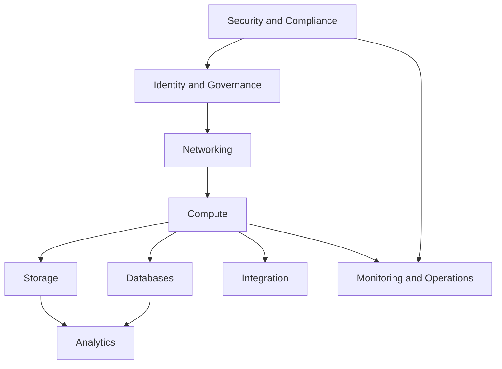
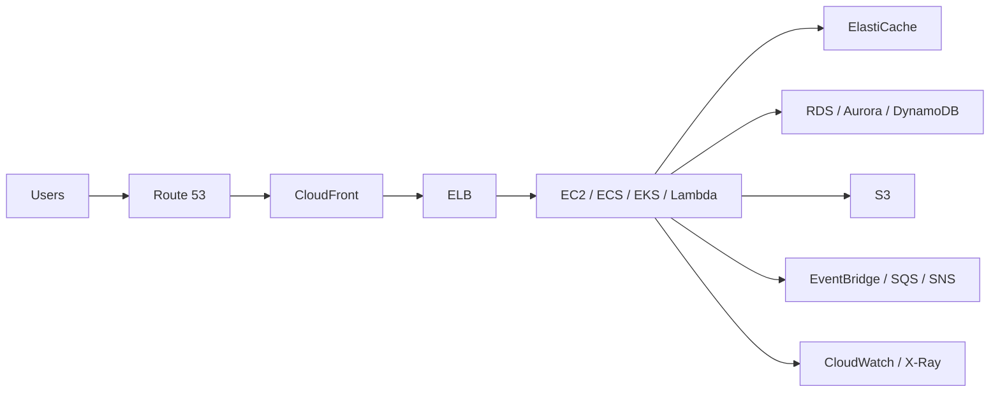

# AWS SAP-C02 Knowledge Hub

This vault is a knowledge-first AWS architecture reference built from the services and topics commonly associated with SAP-C02 scope, but written as service understanding notes rather than exam-prep notes.

## How To Read This Vault

Suggested reading order:

1. Identity, security, and governance
2. Networking, DNS, and edge
3. Compute platforms
4. Storage and databases
5. Integration and event-driven services
6. Monitoring, operations, analytics, and migration

## Identity, Security, and Governance

- [[IAM]]
- [[STS]]
- [[IAM Identity Center]]
- [[AWS Organizations]]
- [[Service Control Policies (SCPs)]]
- [[AWS Resource Access Manager (RAM)]]
- [[KMS]]
- [[AWS CloudHSM]]
- [[ACM]]
- [[WAF]]
- [[Shield]]
- [[AWS Security Hub]]
- [[AWS Config]]
- [[AWS CloudTrail]]
- [[AWS Control Tower]]

## Compute and Application Platforms

- [[Amazon EC2]]
- [[EC2 Auto Scaling]]
- [[Elastic Load Balancing (ELB)]]
- [[AWS Lambda]]
- [[Amazon ECS]]
- [[Amazon EKS]]
- [[AWS Fargate]]
- [[AWS Elastic Beanstalk]]
- [[AWS OpsWorks]]
- [[Amazon ECR]]
- [[EC2 Placement Groups]]

## Storage Services

- [[Amazon S3]]
- [[S3 Storage Classes]]
- [[S3 Lifecycle]]
- [[S3 Replication (SRR and CRR)]]
- [[Amazon EBS]]
- [[Amazon EFS]]
- [[Amazon FSx]]
- [[AWS Storage Gateway]]

## Databases and Caching

- [[Amazon RDS]]
- [[Amazon Aurora]]
- [[Amazon DynamoDB]]
- [[DynamoDB Global Tables]]
- [[Amazon ElastiCache]]
- [[Amazon Redshift]]
- [[Amazon Neptune]]
- [[AWS Database Migration Service (DMS)]]

## Networking, DNS, and Edge

- [[Amazon VPC]]
- [[VPC Subnets]]
- [[VPC Route Tables]]
- [[Internet Gateway (IGW)]]
- [[NAT Gateway and NAT Instances]]
- [[Security Groups]]
- [[Network ACLs (NACLs)]]
- [[VPC Peering]]
- [[AWS PrivateLink]]
- [[AWS Transit Gateway]]
- [[Amazon Route 53]]
- [[Amazon CloudFront]]
- [[AWS Global Accelerator]]
- [[AWS Direct Connect]]
- [[AWS Site-to-Site VPN and Client VPN]]
- [[AWS Local Zones]]
- [[AWS Outposts]]

## Integration and Event-Driven Architecture

- [[Amazon SQS]]
- [[Amazon SNS]]
- [[Amazon EventBridge]]
- [[AWS Step Functions]]
- [[Amazon Kinesis]]

## Management, Monitoring, and Operations

- [[AWS CloudFormation]]
- [[AWS CDK]]
- [[AWS Systems Manager]]
- [[Amazon CloudWatch]]
- [[AWS X-Ray]]
- [[AWS Health]]
- [[Amazon Athena]]
- [[Amazon OpenSearch Service]]

## Analytics and Data Lake

- [[AWS Glue]]
- [[AWS Lake Formation]]
- [[Amazon EMR]]

## Migration and Hybrid

- [[AWS Migration Hub]]
- [[AWS Application Migration Service (MGN)]]

## Core Architecture Maps

### Foundational AWS Stack

### Typical Production Application

