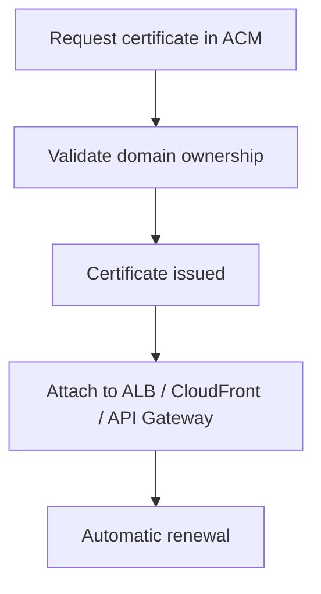

# ACM

## What It Is

[[ACM]] is AWS Certificate Manager, the managed service for provisioning, storing, and renewing TLS certificates used by AWS-integrated endpoints such as Application Load Balancers, CloudFront, and API Gateway.

## Why It Exists

Expired certificates break production traffic fast. Private key handling, renewal workflows, and deployment across many endpoints are easy to get wrong. ACM makes common certificate management safe and mostly automatic inside AWS.

## Core Concepts

- Public certificates
- Private certificates through ACM Private CA
- DNS or email validation
- Automatic renewal
- Service integration
- Regional behavior

## How It Works

For a public certificate, you request it in ACM, prove domain ownership, and then attach the certificate to an AWS-integrated endpoint. ACM stores and renews the certificate automatically.

## When To Use

Use [[ACM]] whenever you need TLS termination on AWS-managed endpoints.

## When Not To Use

Do not use ACM when you need direct export of private keys from standard public ACM certificates or when a certificate must be installed on arbitrary third-party infrastructure.

## Common Use Cases

- Adding HTTPS to an internet-facing load balancer
- Managing custom domain certificates for API Gateway
- Issuing internal certificates for private services with ACM Private CA

## Security And Operations Considerations

Prefer DNS validation because it automates better than email validation. Know the regional placement rules for the service you are attaching to. Restrict who can request, attach, or replace certificates through [[IAM]].

## Common Mistakes

- Requesting a certificate in the wrong region for the target service
- Assuming ACM covers arbitrary non-AWS endpoints
- Forgetting to preserve DNS validation records and breaking auto-renewal

## Practical Example

A team runs a customer-facing application behind an Application Load Balancer. They request a public certificate in ACM for `app.example.com`, validate it with a DNS CNAME record, and attach it to the ALB listener. ACM handles renewal automatically.

## Related Notes

See also [[KMS]], [[AWS CloudHSM]], [[WAF]], [[Shield]], and [[AWS CloudTrail]].
