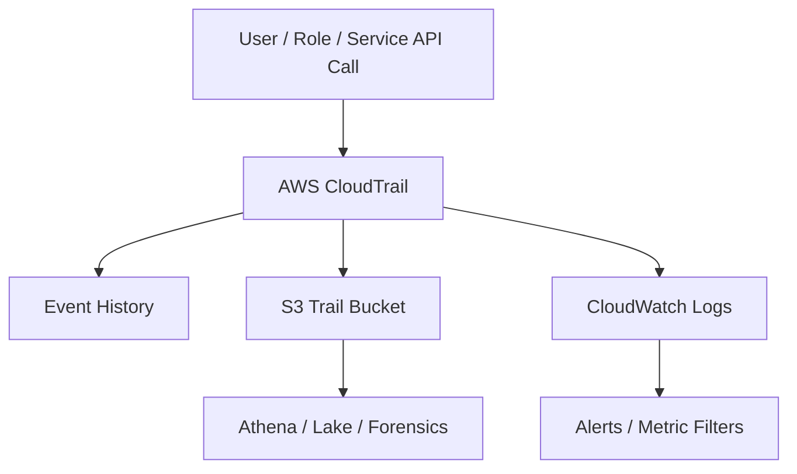

# AWS CloudTrail

## What It Is

AWS CloudTrail is AWS's audit log service for recording account activity and API usage. It captures who did what, when, from where, and through which interface for supported AWS control plane and selected data plane events.

## Why It Exists

AWS environments are operated through APIs. CloudTrail exists so you can answer who changed a resource, when an API call happened, and which credentials were used.

## Core Concepts

- Event history
- Trail
- Management events
- Data events
- Insights events
- Organization trails
- Log file integrity validation

## How It Works

1. AWS services emit API activity events.
2. CloudTrail records those events.
3. Event history provides short-term lookup in-account.
4. Trails deliver events to S3 and optionally CloudWatch Logs.

## When To Use

Use CloudTrail when you need audit history for AWS API activity, incident investigation evidence, governance and accountability for administrative changes, and centralized log retention.

## When Not To Use

CloudTrail is not the right tool when you need resource configuration state over time; use [[AWS Config]]. It does not replace application logs or deep network telemetry.

## Common Use Cases

- Investigating accidental deletion or policy changes
- Alerting on console sign-in anomalies or root account use
- Tracking IAM changes
- Monitoring access to sensitive S3 objects through data events

## Security And Operations Considerations

Store trail logs in a dedicated, access-controlled S3 bucket. Enable encryption and log file integrity validation. Decide carefully which data events to enable because cost and volume can rise quickly.

## Common Mistakes

- Assuming event history is enough for long-term audit needs
- Not enabling trails in all required accounts and Regions
- Ignoring data events for sensitive resources that need object-level auditing
- Sending logs to S3 without protecting the bucket

## Practical Example

A security team creates an organization trail, delivers logs to a centralized encrypted S3 bucket, streams selected events to CloudWatch Logs, and creates alarms for `StopLogging`, `DeleteTrail`, IAM policy changes, and root account usage.

## Related Notes

- [[AWS Config]]
- [[AWS Security Hub]]
- [[AWS Control Tower]]
