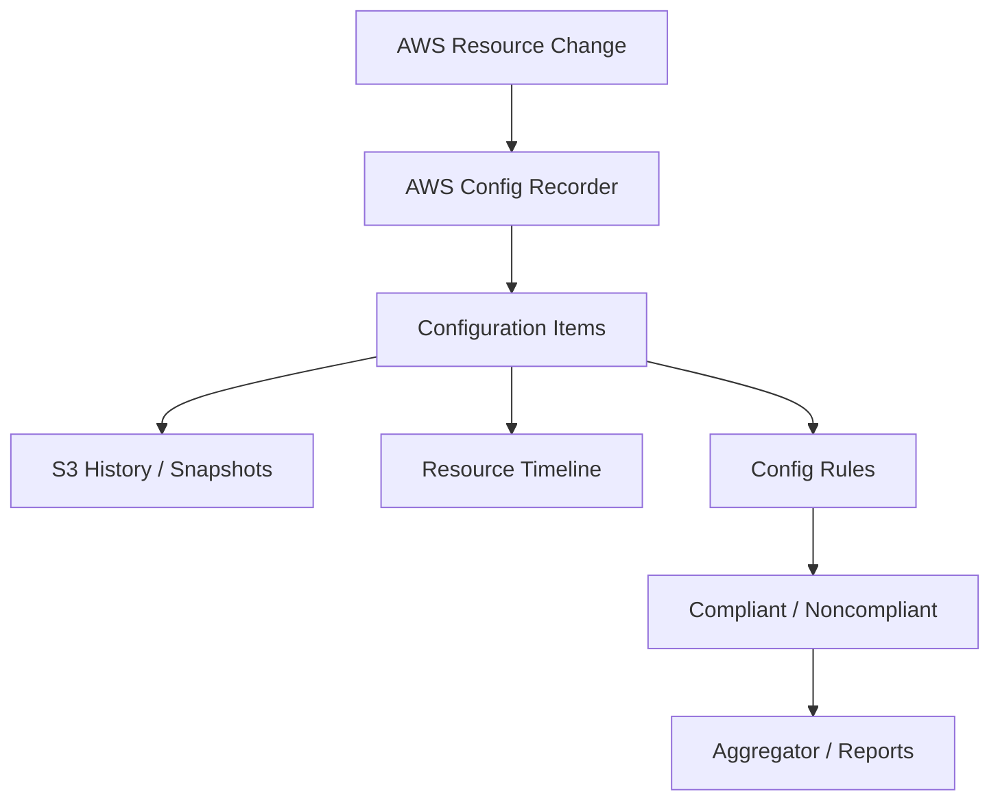

# AWS Config

## What It Is

AWS Config is a configuration recording, change tracking, and compliance evaluation service for AWS resources. It records resource configuration states, tracks how they change over time, and evaluates those configurations against desired rules or policies.

## Why It Exists

In AWS, resources change constantly. Without a system of record, it becomes hard to answer what changed, when it changed, and whether the environment was compliant.

## Core Concepts

- Configuration item
- Configuration recorder
- Delivery channel
- Resource timeline
- Config rules
- Conformance packs
- Aggregators
- Remediation

## How It Works

1. You enable a configuration recorder and delivery channel.
2. AWS Config records supported resource states and changes.
3. Config rules evaluate those resources continuously or on change.
4. Noncompliant resources are flagged.

## When To Use

Use AWS Config when you need change history for AWS resource configurations, compliance evaluation, configuration drift detection, and a timeline for incident investigation.

## When Not To Use

AWS Config is not the right tool when you need API event auditing; use [[AWS CloudTrail]]. It is not a full CMDB for non-AWS infrastructure by default.

## Common Use Cases

- Detecting unencrypted EBS volumes
- Verifying CloudTrail is enabled
- Identifying security groups with risky ingress rules
- Detecting untagged resources

## Security And Operations Considerations

Config is Regional; recorders and rules must be enabled where resources exist. Storage and evaluation can become costly in large, high-change environments. Automated remediation should be tested carefully before broad rollout.

## Common Mistakes

- Enabling rules without enabling the recorder correctly
- Assuming Config records every resource type automatically forever
- Deploying only in one Region and missing others
- Creating too many broad rules that generate noisy noncompliance

## Practical Example

A platform team wants to ensure all S3 buckets use server-side encryption and block public access. They enable AWS Config across production accounts, create managed rules for S3 encryption and public access posture, and aggregate compliance results into a central governance account.

## Related Notes

- [[AWS Security Hub]]
- [[AWS CloudTrail]]
- [[AWS Control Tower]]
