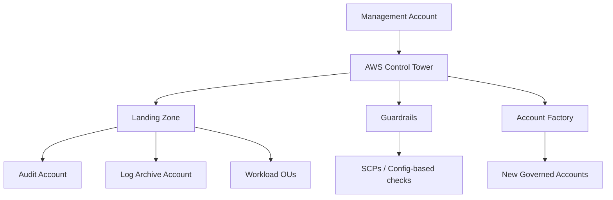

# AWS Control Tower

## What It Is

AWS Control Tower is AWS's managed landing zone service for setting up and governing a multi-account AWS environment based on AWS Organizations. It provides automated account provisioning, baseline guardrails, centralized identity integration, and governance workflows.

## Why It Exists

Operating many AWS accounts manually leads to inconsistency. Logging may be missing, guardrails may differ, and new accounts may be created without standards. Control Tower establishes a governed multi-account foundation with consistent baseline controls.

## Core Concepts

- Landing zone
- AWS Organizations foundation
- Organizational units
- Guardrails
- Account Factory
- Shared accounts such as management, log archive, and audit
- Drift detection and landing zone updates

## How It Works

1. You set up a landing zone in a management account.
2. Control Tower configures AWS Organizations and baseline shared accounts.
3. Guardrails are applied to target OUs.
4. Account Factory provisions new accounts with approved defaults.

## When To Use

Use Control Tower when you need a governed AWS multi-account landing zone, standardized account creation, and baseline security and logging across accounts.

## When Not To Use

Control Tower is not the right tool when you operate a very small single-account environment or require a completely custom multi-account framework and are prepared to own that complexity yourself.

## Common Use Cases

- Establishing a new enterprise AWS landing zone
- Creating separate accounts for production, development, security, and logging
- Standardizing new account provisioning through Account Factory
- Centralizing log archival and audit review

## Security And Operations Considerations

Control Tower is opinionated; align your operating model to it before rollout. Shared accounts such as log archive and audit become critical infrastructure. Existing brownfield environments may require migration planning.

## Common Mistakes

- Treating Control Tower as a complete security program
- Adopting it without a clear account and OU strategy
- Assuming all controls are automatic remediation
- Not understanding how it uses Organizations, SCPs, [[AWS Config]], and [[AWS CloudTrail]]

## Practical Example

A company moving from a single AWS account to dozens of application teams deploys Control Tower, establishes OUs for Sandbox, Infrastructure, Production, and Security, creates shared Audit and Log Archive accounts, and enables account vending through Account Factory.

## Related Notes

- [[AWS CloudTrail]]
- [[AWS Config]]
- [[AWS Security Hub]]
