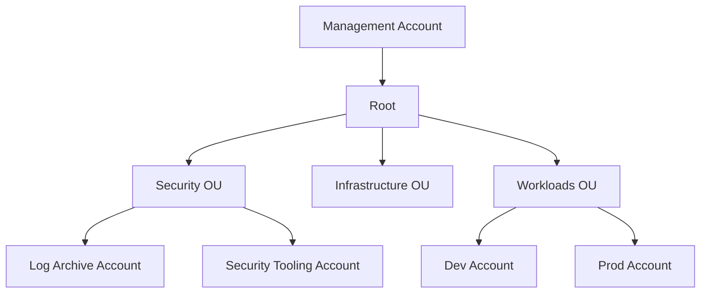

# AWS Organizations

## What It Is

[[AWS Organizations]] is the account management framework for grouping AWS accounts under centralized governance. It lets you create or invite accounts into an organization, arrange them into organizational units (OUs), apply policies, and manage consolidated billing.

## Why It Exists

A serious AWS environment almost always becomes multi-account. Teams need isolation, separate blast radiuses, clearer billing, delegated administration, and policy boundaries between environments.

## Core Concepts

- Management account
- Member account
- Organizational Unit (OU)
- Policy types including [[Service Control Policies (SCPs)]]
- Consolidated billing
- Delegated administrator

## How It Works

Organizations defines the hierarchy. Accounts sit under OUs, and policies can be attached at the root, OU, or account level. Some services then operate centrally across the estate, especially when combined with delegated admin models.

## When To Use

Use [[AWS Organizations]] as soon as you expect more than a small handful of accounts or need central governance.

## When Not To Use

Do not use one giant account with naming conventions as a substitute for account boundaries when isolation matters. Also do not overcomplicate the OU structure on day one.

## Common Use Cases

- Separating production from non-production accounts
- Centralizing logging into a dedicated archive account
- Creating a security tooling account for [[AWS Security Hub]], [[AWS Config]], and [[AWS CloudTrail]]
- Applying guardrails through [[Service Control Policies (SCPs)]]
- Sharing resources with [[AWS Resource Access Manager (RAM)]] across accounts

## Security And Operations Considerations

Treat the management account as highly sensitive. Avoid daily engineering work there. Lock it down with strong MFA, minimal standing access, and limited service usage. Use delegated admin accounts for operational services whenever supported.

## Common Mistakes

- Using the management account for shared workloads
- Designing OUs around current reporting lines instead of durable control needs
- Attaching broad SCPs without testing service impact
- Assuming consolidated billing means all accounts are equally trusted

## Practical Example

A company creates an organization with OUs for Security, Infrastructure, Sandbox, and Production. The Security OU contains a log archive account and a security tooling account. The Production OU has stricter SCPs, mandatory logging, and tighter role assignment via [[IAM Identity Center]].

## Related Notes

See also [[Service Control Policies (SCPs)]], [[IAM Identity Center]], [[AWS Resource Access Manager (RAM)]], [[AWS CloudTrail]], [[AWS Config]], [[AWS Security Hub]], and [[AWS Control Tower]].
