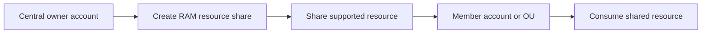

# AWS Resource Access Manager (RAM)

## What It Is

[[AWS Resource Access Manager (RAM)]] is a service for sharing supported AWS resources across AWS accounts or within an [[AWS Organizations]] structure. It lets one account own a resource while other accounts use it, without copying or recreating that resource.

## Why It Exists

In multi-account AWS setups, some resources are better centralized than duplicated. Shared subnets, Route 53 Resolver rules, or transit gateways often need central ownership with controlled consumption.

## Core Concepts

- Resource share
- Principal
- Owner account
- Consumer account
- Organization integration
- Supported resource types only

## How It Works

The owner creates a resource share and adds supported resources plus target principals. Depending on the setup, the recipient may need to accept the share, or the share may become active automatically within the organization.

## When To Use

Use [[AWS Resource Access Manager (RAM)]] when central ownership is useful but consumption needs to be distributed.

## When Not To Use

Do not use RAM when a resource type is unsupported, when strong ownership isolation is required, or when independent lifecycle control per account matters more than centralization.

## Common Use Cases

- A networking account shares subnets to application accounts
- A central infrastructure team shares a transit gateway with business unit accounts
- Shared Route 53 Resolver DNS forwarding rules

## Security And Operations Considerations

Resource sharing does not remove the need for good permission design. Consumers still need appropriate [[IAM]] permissions to use shared resources. Understand who owns deletion, configuration changes, and incident response.

## Common Mistakes

- Assuming RAM works like generic cross-account access for every service
- Centralizing resources without clarifying who supports them
- Forgetting that resource ownership, billing, and lifecycle stay in the owner account

## Practical Example

A company uses a dedicated network account that owns a VPC and subnets for a shared services environment. Through VPC sharing backed by RAM, the platform team shares selected subnets with workload accounts while retaining control over core network architecture.

## Related Notes

See also [[AWS Organizations]], [[IAM]], [[Service Control Policies (SCPs)]], and [[AWS Control Tower]].
