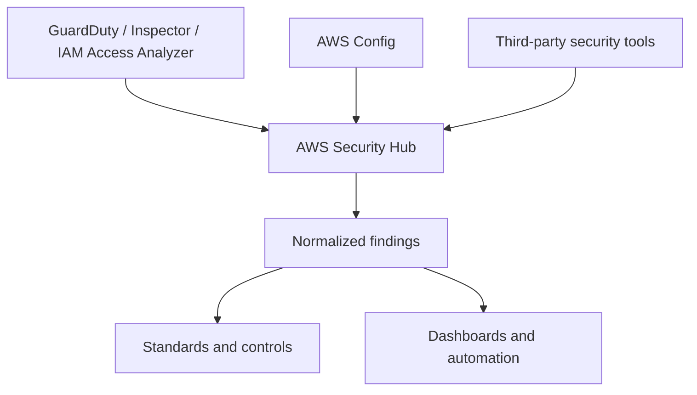

# AWS Security Hub

## What It Is

AWS Security Hub is AWS's centralized security posture and findings aggregation service. It collects, normalizes, correlates, and prioritizes security findings from AWS services and supported third-party tools across accounts and Regions.

## Why It Exists

Security data in AWS often ends up fragmented across services such as [[AWS Config]], GuardDuty, Inspector, IAM Access Analyzer, and partner tools. Security Hub gives security and operations teams a single place to answer what issues exist, which matter most, and what should be remediated first.

## Core Concepts

- Findings
- AWS Security Finding Format (ASFF)
- Security standards
- Controls
- Insights
- Cross-account and multi-Region aggregation
- Automation rules and integrations

## How It Works

1. You enable Security Hub in one or more accounts and Regions.
2. AWS services and partner tools send findings into Security Hub.
3. Security Hub normalizes them into ASFF.
4. Enabled standards run controls against your environment.
5. Findings and failed controls appear in a central console and APIs.

## When To Use

Use Security Hub when you need a central security findings plane across AWS accounts, standardized security reporting, and continuous checks against AWS security best practices.

## When Not To Use

Do not treat Security Hub as a full SIEM replacement, a vulnerability scanner, or a magic security program. It is an aggregation and posture layer.

## Common Use Cases

- Centralizing GuardDuty, Inspector, and Config findings
- Tracking standards-based control failures across environments
- Routing high-severity findings to incident workflows
- Suppressing accepted-risk findings while keeping audit history

## Security And Operations Considerations

Findings are Regional, so decide on an aggregation strategy. Standards can generate large volumes of findings; tune what matters. Many controls depend on [[AWS Config]] recorders and rules being active.

## Common Mistakes

- Enabling Security Hub but not assigning owners for findings
- Treating all failed controls as equally urgent
- Ignoring Region-by-Region coverage gaps
- Assuming Security Hub performs remediation automatically

## Practical Example

A company runs workloads in 40 AWS accounts. Security enables Security Hub with a delegated admin account, aggregates findings from GuardDuty and [[AWS Config]], enables AWS Foundational Security Best Practices, and routes critical findings to ServiceNow via EventBridge and Lambda.

## Related Notes

- [[AWS Config]]
- [[AWS CloudTrail]]
- [[AWS Control Tower]]
