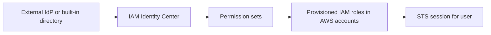

# IAM Identity Center

## What It Is

[[IAM Identity Center]] is AWS's workforce access service for centrally managing human access to one or more AWS accounts and applications. It provides single sign-on, permission set management, and integration with identity sources such as an internal directory or external IdPs like Microsoft Entra ID or Okta.

## Why It Exists

Managing AWS access by creating IAM users in each account does not scale. It creates password sprawl, inconsistent permissions, weak offboarding, and poor auditability. Identity Center centralizes user access, delegates authentication to a proper identity source, and maps users or groups to account roles cleanly.

## Core Concepts

- Identity source
- Permission set
- Assignment
- AWS access portal
- Provisioning into target accounts
- Account instance role

## How It Works

Identity Center authenticates the user, then presents the set of AWS accounts and applications the user is allowed to access. For AWS access, the service creates and manages roles in the target accounts. When the user chooses an account and role, AWS issues temporary credentials through [[STS]].

## When To Use

Use [[IAM Identity Center]] for almost all human access to AWS, especially in multi-account environments managed with [[AWS Organizations]] or [[AWS Control Tower]].

## When Not To Use

Do not use it for machine-to-machine runtime access; workloads should use IAM roles directly. Do not use it as a customer identity platform when you really need application-user authentication products.

## Common Use Cases

- Mapping the platform team to administrator roles in sandbox accounts and restricted admin roles in production
- Giving auditors read-only access across all accounts
- Integrating with Okta so offboarding instantly removes AWS access
- Exposing selected AWS accounts to contractors through tightly scoped permission sets

## Security And Operations Considerations

Group-based assignments scale better than user-based assignments. Prefer permission sets aligned to job functions rather than accounts. Use short session durations for sensitive roles. Protect the upstream identity source with MFA and strong lifecycle controls.

## Common Mistakes

- Treating permission sets as ad hoc exceptions rather than standardized access profiles
- Assigning permissions directly to users instead of groups
- Leaving legacy IAM users active for the same people
- Using a single giant administrator permission set for everyone

## Practical Example

A company with 80 AWS accounts uses Microsoft Entra ID as its identity source. Developers are placed in groups such as `aws-dev-readonly` and `aws-dev-poweruser`. Those groups are assigned to permission sets in selected accounts. A developer signs in once, chooses a dev account from the access portal, and receives an STS session for the provisioned role.

## Related Notes

See also [[IAM]], [[STS]], [[AWS Organizations]], and [[AWS Control Tower]].
