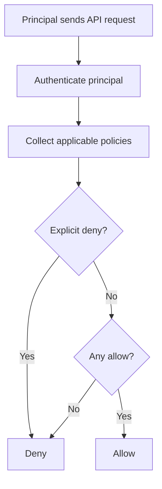

# IAM

## What It Is

[[IAM]] is AWS's primary authorization system for controlling who can do what in an AWS account. It defines identities such as users, groups, and roles, and attaches policies that allow or deny API actions on AWS resources. It is foundational rather than optional: almost every AWS action is evaluated through IAM.

## Why It Exists

AWS needs a consistent way to answer questions like: can this principal call `s3:GetObject` on this bucket, or `ec2:RunInstances` in this account? Without IAM, every service would need its own access model, and organizations would have no uniform way to manage least privilege, automation access, or cross-account permissions.

## Core Concepts

- Principal: the identity making the request, such as an IAM user, IAM role, federated session, or AWS service
- Policy: a JSON document that defines allowed or denied actions
- Identity-based policy: attached to a user, group, or role
- Resource-based policy: attached directly to a resource, such as an S3 bucket policy or KMS key policy
- Role: a principal intended to be assumed temporarily, often by workloads or users
- Trust policy: defines who can assume a role
- Permission boundary: limits the maximum permissions an identity can receive
- Session policy: temporary restriction applied when a role is assumed
- Explicit deny: always wins over allow

## How It Works

Every AWS API request goes through policy evaluation. AWS gathers applicable identity-based policies, resource-based policies, session policies, permission boundaries, and organization-level controls such as [[Service Control Policies (SCPs)]]. It then evaluates them together.

The rough logic is:

1. Start with implicit deny.
2. If any relevant policy explicitly denies the request, deny it.
3. If at least one applicable policy allows it, allow it.
4. Otherwise, deny it.

IAM also supports conditions, which are where most real-world control lives. Conditions can restrict access by source IP, MFA presence, requested region, resource tags, principal tags, VPC endpoint, and many other attributes.

## When To Use

Use [[IAM]] whenever you need to grant access to people, workloads, or services inside AWS. It is the default control plane for human admin and operator permissions, EC2 instance roles, Lambda execution roles, CI/CD access, and cross-account delegation.

## When Not To Use

Do not use long-lived IAM users and access keys for modern workforce access if [[IAM Identity Center]] or federation is available. Do not use broad wildcard policies when a narrower role will do. Do not treat IAM as a network security control; it complements, but does not replace, VPC design, security groups, or service-specific protections.

## Common Use Cases

- Granting a Lambda function access to DynamoDB and CloudWatch Logs
- Giving a deployment pipeline permission to push to ECR and update ECS
- Letting a central security account assume read-only roles in member accounts
- Restricting developers to tagged resources in non-production environments

## Security And Operations Considerations

Prefer roles over IAM users. Keep policies small, readable, and task-oriented. Use managed policies carefully; customer-managed policies are easier to review than large inline policy sprawl. Turn on logging with [[AWS CloudTrail]] and configuration tracking with [[AWS Config]]. Review last-accessed information, access analyzer findings, and unused roles periodically.

Use conditions aggressively. A policy that allows `kms:Decrypt` only from a specific role, region, and VPC endpoint is much safer than a plain allow.

## Common Mistakes

- Using `Action: "*"`, `Resource: "*"` as a shortcut and never tightening it
- Storing access keys in code or CI variables instead of using roles
- Forgetting that an explicit deny in another layer can block an apparently valid allow
- Giving humans direct administrative users instead of federated role-based access
- Confusing a role's trust policy with its permission policy

## Practical Example

A Lambda function needs to read from one S3 bucket and write to one DynamoDB table. The correct pattern is to create a dedicated IAM role for the function, attach a policy granting only `s3:GetObject` on that bucket path and `dynamodb:PutItem` on that table, and let Lambda assume the role automatically. That avoids embedded secrets and limits blast radius if the function is compromised.

## Related Notes

See also [[STS]], [[IAM Identity Center]], [[AWS Organizations]], [[Service Control Policies (SCPs)]], [[KMS]], and [[AWS CloudTrail]].
