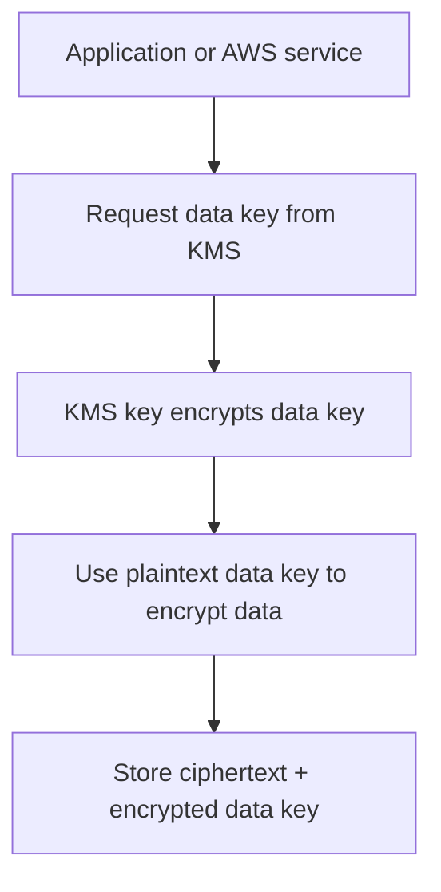

# KMS

## What It Is

[[KMS]] is AWS Key Management Service, the managed key service used to create, control, and use cryptographic keys across AWS. It is deeply integrated with AWS services for encryption at rest and supports direct API use for application-level encryption patterns.

## Why It Exists

Encryption is easy to demand and hard to operate well. The hard parts are key storage, access control, rotation, auditability, lifecycle management, and service integration. KMS provides managed cryptographic controls without requiring customers to run hardware security infrastructure themselves.

## Core Concepts

- KMS key
- Key material
- Symmetric vs asymmetric keys
- Customer managed keys vs AWS managed keys
- Key policy
- Grants
- Envelope encryption
- Multi-Region keys

## How It Works

Most AWS services use [[KMS]] through envelope encryption:

1. A service requests a data key from KMS.
2. KMS returns a plaintext data key and a copy encrypted under the KMS key.
3. The service encrypts the data with the plaintext data key.
4. The encrypted data key is stored with the ciphertext.
5. To decrypt later, the service asks KMS to decrypt the encrypted data key.

## When To Use

Use [[KMS]] for most AWS-native encryption needs across S3, EBS, RDS, EFS, application secrets or payload encryption, and centralized cryptographic audit trails.

## When Not To Use

Do not use KMS as a general-purpose secret store. Do not use it for extremely high-throughput, low-latency cryptography without understanding request quotas and cost. If you need direct hardware tenancy or customer-operated HSM control, [[AWS CloudHSM]] may fit better.

## Common Use Cases

- Encrypting S3 buckets with customer-managed keys
- Protecting EBS volumes containing sensitive workloads
- Cross-account encryption and decryption with controlled key policies
- Signing artifacts using asymmetric KMS keys

## Security And Operations Considerations

Key policy design is the hard part. Enable key rotation where appropriate, but understand that rotation changes backing material, not application semantics. Monitor key usage via [[AWS CloudTrail]]. Be deliberate about deletion windows; scheduling key deletion can create unrecoverable data loss.

## Common Mistakes

- Assuming IAM alone controls key access
- Using a single broad key for unrelated applications and data classes
- Scheduling key deletion without full dependency mapping
- Encrypting large application payloads directly with KMS instead of envelope encryption

## Practical Example

A payments service stores documents in S3 using SSE-KMS with a customer-managed key. The application role can put and get objects, but only the processing role can decrypt using the KMS key. Security admins can manage key policy and rotation but cannot read the data itself.

## Related Notes

See also [[AWS CloudHSM]], [[ACM]], [[IAM]], [[STS]], and [[AWS CloudTrail]].
