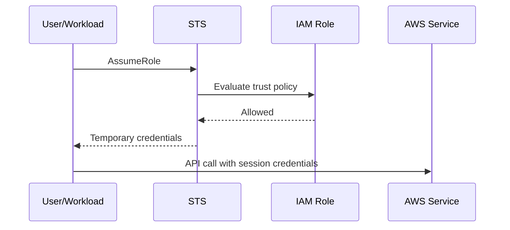

# STS

## What It Is

[[STS]] is AWS Security Token Service, the system that issues temporary AWS credentials. These credentials include an access key ID, secret access key, and session token, and they expire automatically. STS is the engine behind assumed roles, federated access, and most modern AWS authentication flows.

## Why It Exists

Permanent credentials are hard to secure, rotate, and track. AWS needs a way to let a principal obtain just-in-time access to a defined set of permissions for a limited time. STS solves that by minting short-lived sessions instead of relying on static IAM keys.

## Core Concepts

- Temporary credentials
- AssumeRole
- Session duration
- Session name
- External ID
- Web identity federation
- Role chaining
- Caller identity via `GetCallerIdentity`

## How It Works

STS does not define permissions itself. It issues credentials for a role or federated identity, and that session inherits permissions from IAM plus any session restrictions.

1. A principal is authenticated somehow.
2. That principal calls STS to assume a role.
3. STS validates that the trust policy allows the assumption.
4. STS returns temporary credentials.
5. The principal uses those credentials to call AWS APIs until the session expires.

## When To Use

Use [[STS]] whenever access should be temporary: human access through [[IAM Identity Center]], EC2/Lambda/ECS/EKS workload credentials, cross-account administration, CI/CD pipelines, and third-party vendor access.

## When Not To Use

Do not build systems around permanent IAM user credentials if STS-backed role assumption is possible. Do not assume that short-lived credentials remove the need for least privilege; overpowered temporary credentials are still overpowered.

## Common Use Cases

- A developer signs in through SSO and receives role-based AWS access
- A Lambda function automatically receives execution-role credentials
- A central logging account assumes read roles in member accounts
- GitHub Actions uses OIDC to obtain an AWS deployment role without stored secrets

## Security And Operations Considerations

Set appropriate session durations. Use meaningful session names and tags so [[AWS CloudTrail]] records are attributable. For third-party access, require an external ID in the trust policy. Regional STS endpoints can improve resilience and reduce dependence on a single control plane path.

## Common Mistakes

- Giving vendors cross-account roles without external IDs
- Allowing overly broad principals in trust policies
- Ignoring session tags and losing attribution in logs
- Chaining roles unnecessarily and hitting duration limits
- Misunderstanding that STS only issues credentials and permissions still come from [[IAM]]

## Practical Example

A deployment workflow in GitHub Actions uses OIDC to call `AssumeRoleWithWebIdentity`. AWS validates the OIDC claims against the role trust policy, issues temporary credentials, and the workflow deploys infrastructure without any stored long-lived AWS secret.

## Related Notes

See also [[IAM]], [[IAM Identity Center]], [[AWS Organizations]], and [[AWS CloudTrail]].
