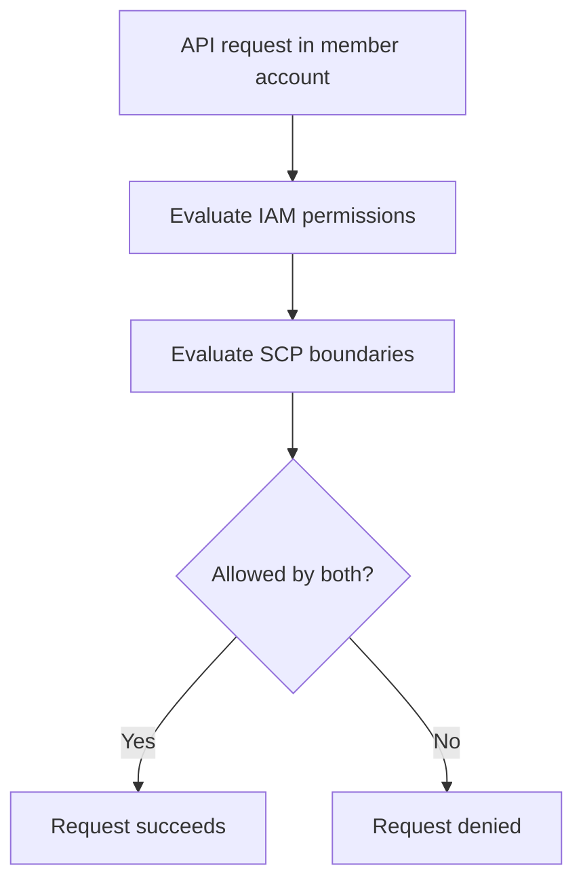

# Service Control Policies (SCPs)

## What It Is

[[Service Control Policies (SCPs)]] are organization-level guardrail policies used in [[AWS Organizations]] to define the maximum available permissions for member accounts. They do not grant permissions. Instead, they limit what identities in those accounts can ever do, even if local IAM policies allow it.

## Why It Exists

In a multi-account environment, relying only on account-local [[IAM]] is not enough. A local admin could create powerful roles or bypass intended restrictions. SCPs exist to enforce central boundaries such as no one can disable CloudTrail, only approved regions may be used, or production accounts cannot leave the organization.

## Core Concepts

- Maximum permissions boundary at account scope
- Inheritance through root, OUs, and account attachments
- No grant behavior
- Explicit deny focus

## How It Works

When a principal in a member account makes an API request, AWS evaluates local IAM permissions and organization guardrails together. If the action is denied by an SCP, the request fails even if the role is otherwise admin.

## When To Use

Use SCPs for broad, durable guardrails: region restrictions, preventing account tampering, protecting centralized logging and security tooling, and disallowing risky services in restricted environments.

## When Not To Use

Do not use SCPs for fine-grained workload authorization inside an account; that is what [[IAM]] is for. Do not encode every local exception into SCPs.

## Common Use Cases

- Denying `cloudtrail:StopLogging` and `cloudtrail:DeleteTrail`
- Denying creation of resources outside approved regions
- Blocking `iam:CreateUser` to force workforce access through [[IAM Identity Center]]
- Preventing member accounts from leaving the organization

## Security And Operations Considerations

Start simple. A small set of deny guardrails often provides most of the value. Test changes in a lower-risk OU first; a badly written SCP can lock out operations fast. Keep break-glass paths defined.

## Common Mistakes

- Expecting SCPs to grant access
- Attaching broad denies at the root too early
- Using SCPs to solve account-local least privilege problems
- Blocking the very automation needed to remediate issues

## Practical Example

An organization wants all production workloads to stay in `eu-west-1` and `eu-central-1`. It attaches an SCP to the Production OU that denies requests when `aws:RequestedRegion` is not one of those regions, with carve-outs for global services.

## Related Notes

See also [[AWS Organizations]], [[IAM]], [[IAM Identity Center]], [[AWS CloudTrail]], [[AWS Config]], and [[AWS Control Tower]].
