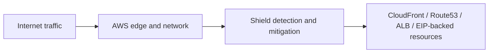

# Shield

## What It Is

[[Shield]] is AWS's managed DDoS protection service. It protects AWS applications from network and transport-layer distributed denial of service attacks, with additional capabilities in Shield Advanced.

## Why It Exists

Public-facing systems are exposed not only to application abuse but also to volume-based and protocol-based attacks designed to exhaust bandwidth or infrastructure state. Shield provides baseline protection and enhanced operational support for critical workloads.

## Core Concepts

- Shield Standard
- Shield Advanced
- Protected resources
- DDoS response team
- Cost protection

## How It Works

AWS monitors traffic patterns at its edge and network layers. Shield detects anomalous DDoS patterns and applies mitigations in the AWS network path.

## When To Use

Use Shield Standard implicitly for all public AWS workloads. Consider Shield Advanced for high-value public applications, critical APIs, and workloads likely to be targeted.

## When Not To Use

Do not assume Shield solves Layer 7 application abuse by itself; that is where [[WAF]] becomes important.

## Common Use Cases

- Protecting a public API fronted by CloudFront
- Adding stronger DDoS visibility to a major e-commerce platform
- Pairing CloudFront, Route 53, [[WAF]], and Shield Advanced for layered edge defense

## Security And Operations Considerations

Availability design still matters. Shield does not replace multi-AZ design, cache strategy, origin scaling, or incident runbooks. For high-value apps, combine Shield with CloudFront, [[WAF]], health-based DNS strategies, and autoscaling.

## Common Mistakes

- Assuming Shield Standard and Shield Advanced provide the same operational value
- Expecting DDoS protection to fix weak origin scaling or brittle app design
- Not pairing Shield with WAF for HTTP-focused abuse

## Practical Example

An online retailer serves most traffic through CloudFront and an ALB-backed origin. Before a major sales event, the team enables Shield Advanced for the key distribution and public endpoints, verifies escalation setup, and pairs it with tuned [[WAF]] rules.

## Related Notes

See also [[WAF]], [[ACM]], [[AWS CloudTrail]], [[AWS Security Hub]], and [[AWS Control Tower]].
