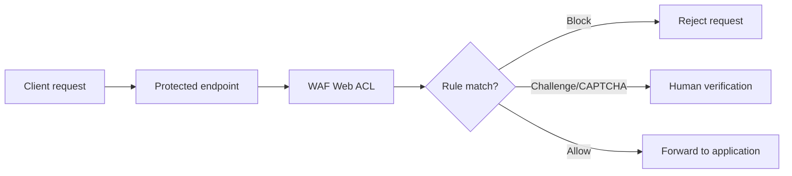

# WAF

## What It Is

[[WAF]] is AWS Web Application Firewall, a Layer 7 filtering service that inspects HTTP and HTTPS requests to supported endpoints such as CloudFront, Application Load Balancer, and API Gateway. It helps block malicious web traffic before it reaches the application.

## Why It Exists

Application-layer attacks do not look like normal network-layer abuse. SQL injection attempts, bad bots, credential stuffing, and path abuse can all get through basic network controls. WAF gives operators request-aware filtering close to the edge or load balancer.

## Core Concepts

- Web ACL
- Rule
- Managed rule groups
- Custom rules
- Rate-based rules
- Labels

## How It Works

A request arrives at an integrated service. The associated web ACL evaluates rules in order. Depending on matches and priorities, the request is allowed, blocked, counted, or challenged.

## When To Use

Use [[WAF]] when your application is exposed over HTTP(S) and you need request-level protection.

## When Not To Use

Do not use WAF as a replacement for secure coding, authentication controls, or API authorization. It is also not a generic network firewall.

## Common Use Cases

- Enabling AWS managed rule groups for common web exploits
- Rate-limiting login attempts
- Blocking traffic from specific geographies or IP ranges
- Filtering abusive user agents

## Security And Operations Considerations

Start in count mode when introducing aggressive rules, especially for custom logic. Managed rules are valuable but not magic. Logging matters; use sampled requests and centralized analysis.

## Common Mistakes

- Enabling many managed rules blindly and causing false positives
- Assuming WAF removes the need for input validation or authentication controls
- Forgetting to log or review blocked requests

## Practical Example

A public login API behind CloudFront is seeing credential stuffing. The team attaches a web ACL with AWS managed rules, a rate-based rule per source IP, and a rule that challenges suspicious request patterns.

## Related Notes

See also [[Shield]], [[ACM]], [[AWS CloudTrail]], [[AWS Security Hub]], and [[AWS Config]].
