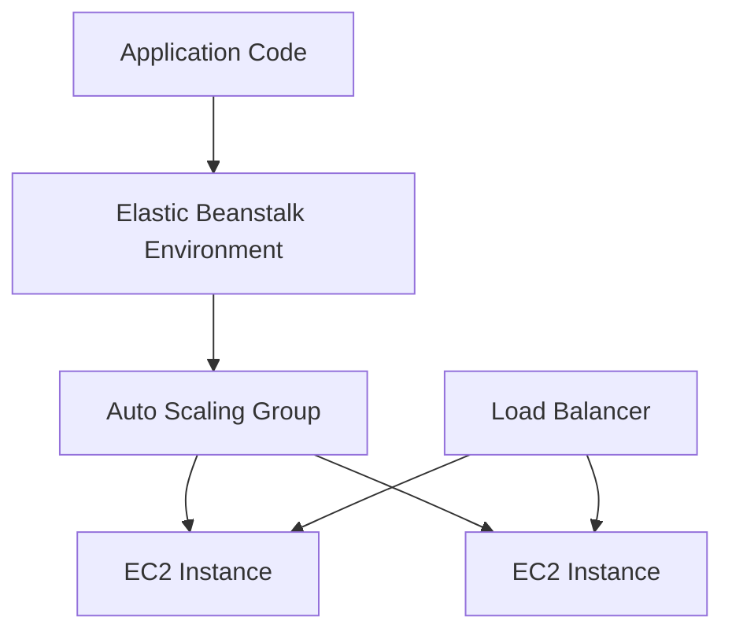

# AWS Elastic Beanstalk

## What It Is

AWS Elastic Beanstalk is a managed application platform for deploying and operating web applications and services. You provide application code and platform configuration; AWS provisions and coordinates supporting infrastructure such as EC2, Auto Scaling, and load balancing.

## Why It Exists

Elastic Beanstalk reduces the amount of infrastructure assembly required for common application deployments while still letting teams use familiar application stacks.

## Core Concepts

- Environment
- Platform
- Application version
- Environment configuration
- Managed resources including EC2, ELB, and Auto Scaling

## How It Works

You upload application code or connect a deployment pipeline. Elastic Beanstalk provisions an environment using AWS resources under the hood and deploys the application to EC2 instances.

## When To Use

Use Elastic Beanstalk when you have a conventional web app and want faster AWS deployment without designing every EC2 and ALB detail.

## When Not To Use

Do not use it when you need full control over a custom platform topology, want container orchestration at scale, or prefer fully explicit infrastructure-as-code.

## Common Use Cases

- Traditional MVC web applications
- Internal line-of-business apps
- Small-to-medium APIs
- Monoliths being deployed into AWS

## Operations And Cost Considerations

Elastic Beanstalk is simpler than building equivalent EC2 infrastructure manually, but you still pay for underlying resources and should understand the generated components.

## Common Mistakes

- Treating Elastic Beanstalk as fully hands-off while ignoring underlying EC2 operations
- Using it when the application should really move to containers or serverless
- Accumulating opaque environment config drift

## Practical Example

A team has a Django application and wants to deploy quickly on AWS without designing every EC2 and ALB detail. They use Elastic Beanstalk to provision web environments across multiple AZs, attach an ALB, and manage rolling deployments.

## Related Notes

- [[Amazon EC2]]
- [[EC2 Auto Scaling]]
- [[Elastic Load Balancing (ELB)]]
- [[Amazon ECS]]
- [[AWS Lambda]]
