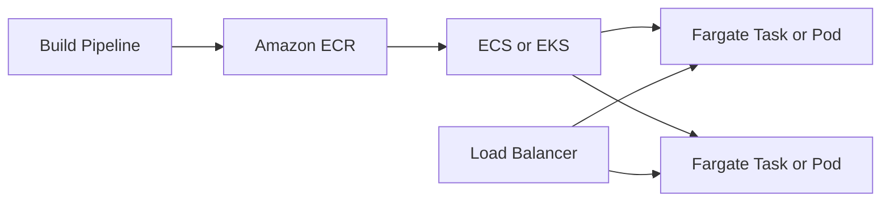

# AWS Fargate

## What It Is

AWS Fargate is serverless compute for containers. It lets you run containers without managing the underlying EC2 instances.

## Why It Exists

Containers reduce packaging friction, but host management still remains. Fargate removes host provisioning, patching, and capacity management for many container workloads.

## Core Concepts

- Task or pod level compute
- No host management
- ECS and EKS integration
- Networking with per-task ENIs in many designs

## How It Works

You define a container workload through ECS or EKS, choose Fargate as the launch or execution mode, and AWS runs the container on managed infrastructure.

## When To Use

Use Fargate when you want containers without EC2 fleet management, have small to medium services where operational simplicity matters, or want isolated task-level environments.

## When Not To Use

Do not use Fargate when you need very low-level host control, specialized hardware, or have extremely steady workloads where EC2-backed containers are materially cheaper.

## Common Use Cases

- APIs and web services
- Background workers
- Scheduled jobs
- Internal tools
- Event-driven container workloads

## Operations And Cost Considerations

Fargate is simpler than managing EC2 worker nodes, but you still need container image, security, IAM, scaling, and observability discipline. You pay for allocated CPU and memory per running workload.

## Common Mistakes

- Assuming serverless means no operational design is required
- Using Fargate when EC2-backed ECS would be much cheaper at scale
- Overallocating CPU and memory because per-task sizing feels abstract

## Practical Example

A team has five internal services and two queue workers. They package everything as containers but do not want to manage EC2 nodes, so they choose ECS on Fargate with ALB for public APIs and autoscaling for task counts.

## Related Notes

- [[Amazon ECS]]
- [[Amazon EKS]]
- [[Amazon ECR]]
- [[AWS Lambda]]
- [[Amazon EC2]]
