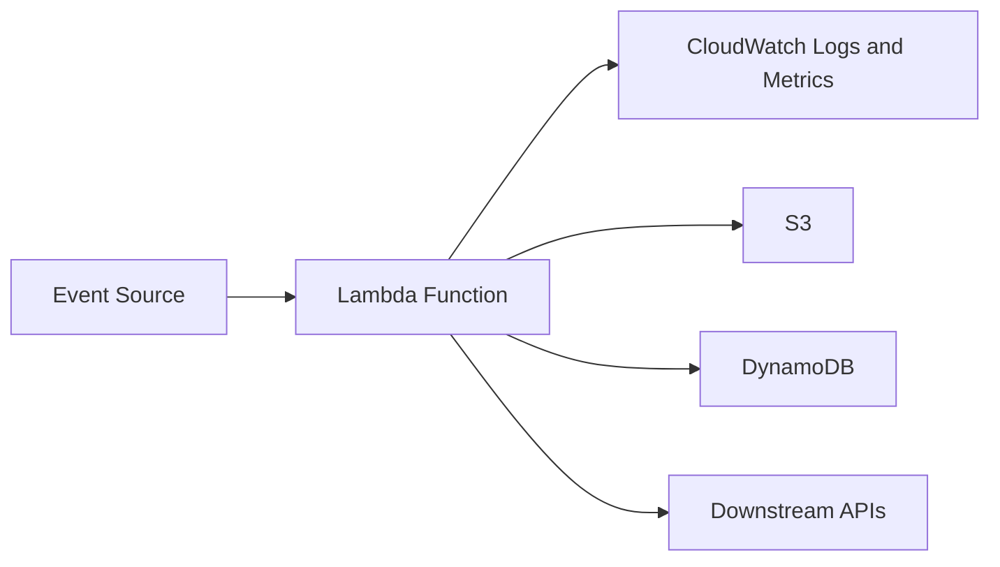

# AWS Lambda

## What It Is

AWS Lambda is a serverless compute service that runs code in response to events without requiring you to provision or manage servers.

## Why It Exists

Lambda reduces operational overhead for event-driven and short-lived compute workloads. It removes server management for many patterns, scales automatically, and prices execution based on actual usage.

## Core Concepts

- Function
- Event source
- Execution role
- Concurrency
- Cold start
- Timeout
- Layers
- Environment variables

## How It Works

An event source triggers the function. Lambda prepares or reuses an execution environment, loads the function code, executes the handler, and returns a response or emits success/failure outcomes depending on the integration.

## When To Use

Use Lambda for event-driven processing, lightweight APIs, file and object processing, scheduled tasks, queue consumers, automation, and bursty workloads.

## When Not To Use

Do not use Lambda for very long-running processes, workloads needing deep OS control, or large monolithic services with heavy startup overhead.

## Common Use Cases

- Image or document processing from S3 events
- API backends
- ETL steps
- Notifications and workflow orchestration
- Scheduled maintenance jobs

## Operations And Cost Considerations

Observe timeout, memory, concurrency, and retry settings carefully. Function memory also affects CPU allocation. Pricing depends on number of requests, execution duration, and allocated memory.

## Common Mistakes

- Using Lambda for a workload that should be a container or EC2 service
- Ignoring idempotency and causing duplicate side effects
- Using default timeout and memory settings blindly
- Overlooking concurrency impact on downstream systems

## Practical Example

A SaaS app uploads customer PDFs to S3. Each new object triggers a Lambda function that extracts text, stores results in DynamoDB, and publishes a notification event.

## Related Notes

- [[Amazon EC2]]
- [[Amazon ECS]]
- [[AWS Fargate]]
- [[Elastic Load Balancing (ELB)]]
- [[Amazon ECR]]
