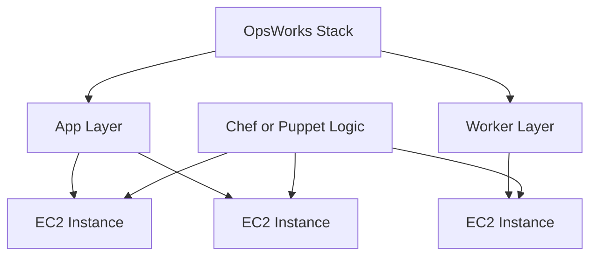

# AWS OpsWorks

## What It Is

AWS OpsWorks is a configuration management and application lifecycle service historically centered around Chef and Puppet-based operational models.

## Why It Exists

OpsWorks exists to help teams automate server configuration, application deployment, and lifecycle management using familiar configuration management approaches.

## Core Concepts

- Stack
- Layer
- Instance lifecycle events
- Recipes and manifests

## How It Works

OpsWorks provisions and coordinates infrastructure and then applies configuration automation based on lifecycle events. It sits closer to the configuration-management era of cloud operations than to modern serverless or container-first patterns.

## When To Use

Use OpsWorks when you already have legacy investment in Chef or Puppet style operational models and are maintaining existing environments built around it.

## When Not To Use

Do not use OpsWorks for a new greenfield architecture. For most new designs, ECS, EKS, Lambda, Systems Manager, or direct infrastructure-as-code patterns are more natural choices.

## Common Use Cases

- Legacy application stacks with established Chef/Puppet workflows
- Long-lived EC2 environments with structured configuration lifecycles
- Transitional environments that predate newer AWS compute patterns

## Operations And Cost Considerations

OpsWorks reflects an older, heavier operational model. Human and maintenance cost is often the bigger concern than service pricing.

## Common Mistakes

- Choosing OpsWorks for a new workload out of familiarity
- Preserving a complex Chef/Puppet stack when the application could be simplified
- Underestimating migration cost away from lifecycle-coupled infrastructure

## Practical Example

A company has an older Rails application estate with years of Chef automation and custom deployment recipes. They continue using OpsWorks for that environment while planning a phased migration toward containers.

## Related Notes

- [[Amazon EC2]]
- [[EC2 Auto Scaling]]
- [[AWS Elastic Beanstalk]]
- [[Amazon ECS]]
- [[AWS Lambda]]
