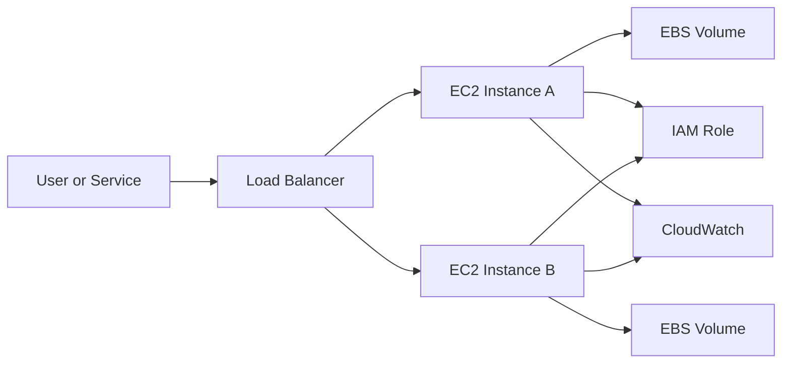

# Amazon EC2

## What It Is

Amazon Elastic Compute Cloud (EC2) is AWS's virtual server service. It provides resizable compute capacity in the form of instances that run operating systems such as Linux or Windows. EC2 is the foundational infrastructure-as-a-service compute building block in AWS.

## Why It Exists

EC2 exists to let teams run workloads without owning physical servers while still preserving the flexibility of traditional infrastructure. It supports workloads that need OS-level access, custom runtimes, or special hardware.

## Core Concepts

- Instance
- AMI
- Instance type
- EBS
- Instance store
- Security group
- Elastic Network Interface
- Key pair
- User data
- IAM role

## How It Works

You launch an instance from an AMI into a VPC subnet, select an instance type, attach storage, assign a security group, and optionally pass user data. AWS places the instance on underlying physical infrastructure and exposes it through APIs.

## When To Use

Use EC2 when you need full OS access, custom agents or drivers, long-running applications, specialized instance families, or traditional server-based applications.

## When Not To Use

If you only need short event-driven code, use [[AWS Lambda]]. If you want container orchestration rather than VM management, use [[Amazon ECS]] or [[Amazon EKS]]. If you want serverless containers, use [[AWS Fargate]].

## Common Use Cases

- Web applications and APIs
- Self-managed databases and middleware
- Batch workers
- Build servers and CI runners
- Bastion hosts
- Machine learning workloads on GPU instances

## Operations And Cost Considerations

You patch the OS and installed software, manage backups, and plan scaling unless combined with [[EC2 Auto Scaling]]. Common pricing models include On-Demand, Savings Plans, Reserved Instances, and Spot Instances.

## Common Mistakes

- Treating instances as pets instead of replaceable units
- Hard-coding secrets on the machine instead of using IAM roles
- Storing important data only on instance store
- Opening security groups too broadly
- Running a single instance without high availability assumptions

## Practical Example

A company hosts a custom Java application that needs a proprietary agent and OS-level tuning. They build a hardened AMI, launch it on `m7i` instances across multiple Availability Zones, place them behind an Application Load Balancer, store application data on EBS, and use [[EC2 Auto Scaling]] for self-healing.

## Related Notes

- [[EC2 Auto Scaling]]
- [[Elastic Load Balancing (ELB)]]
- [[EC2 Placement Groups]]
- [[Amazon ECR]]
- [[Amazon ECS]]
- [[AWS Lambda]]
