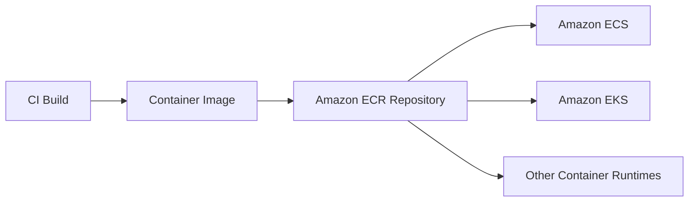

# Amazon ECR

## What It Is

Amazon Elastic Container Registry (ECR) is AWS's managed container image registry. It stores, manages, and distributes container images and related artifacts.

## Why It Exists

Teams using containers need a secure, durable place to store images. ECR provides private image storage in AWS, integrates with IAM, and supports delivery into [[Amazon ECS]], [[Amazon EKS]], and other runtimes.

## Core Concepts

- Repository
- Image
- Tag
- Digest
- Image scanning
- Lifecycle policy
- Cross-region and cross-account patterns

## How It Works

A build pipeline authenticates to ECR, pushes an image, and downstream compute services pull that image when deploying workloads.

## When To Use

Use ECR when you run containerized workloads on AWS and want a managed private registry close to AWS compute.

## When Not To Use

Do not use ECR if you are not using containers or already have a strong non-AWS registry standard that meets your requirements and portability goals.

## Common Use Cases

- CI/CD image storage for ECS services
- Kubernetes image source for EKS clusters
- Promotion of tested images across environments
- Private base image distribution

## Operations And Cost Considerations

Prefer immutable deployment references by digest for production-critical paths. Set lifecycle policies to prevent repository bloat. Costs come from stored image data, transfer, and scanning.

## Common Mistakes

- Deploying mutable tags like `latest` in production
- Treating image scanning results as optional noise
- Keeping every image forever
- Not separating build-time and runtime trust decisions

## Practical Example

A team builds a new API container image on every merge to main, pushes it to ECR, and deploys an ECS service revision using the new image digest.

## Related Notes

- [[Amazon ECS]]
- [[Amazon EKS]]
- [[AWS Fargate]]
- [[AWS Lambda]]
- [[Amazon EC2]]
