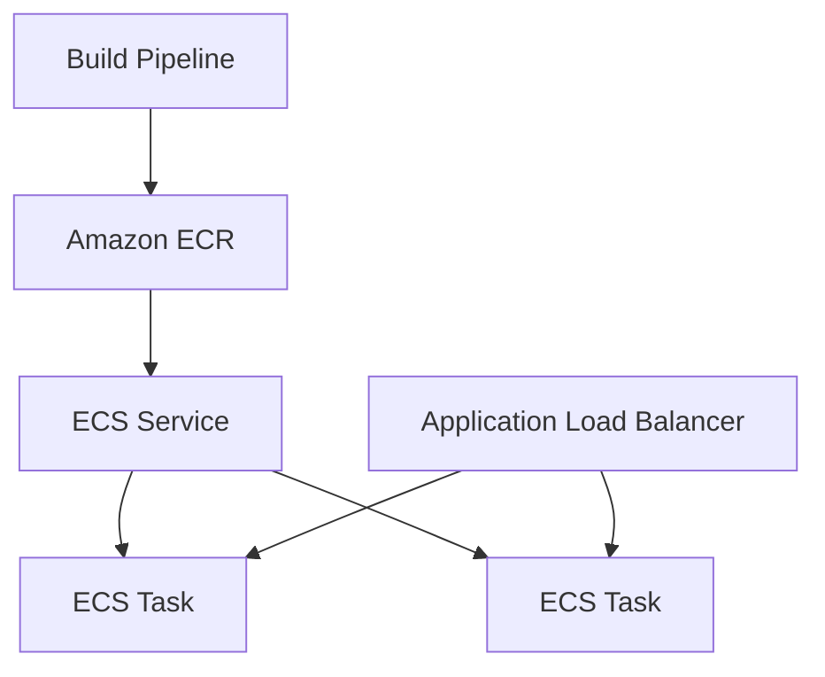

# Amazon ECS

## What It Is

Amazon Elastic Container Service (ECS) is AWS's managed container orchestration service. It schedules and runs containers across a cluster of compute capacity.

## Why It Exists

Containers solve packaging and runtime consistency, but operating them across many hosts requires orchestration. ECS provides that orchestration with less complexity than self-managing a container platform.

## Core Concepts

- Cluster
- Task definition
- Task
- Service
- Capacity provider
- Task role
- Execution role

## How It Works

You push container images to [[Amazon ECR]], define a task definition, create a service, and tell ECS where the tasks should run. For EC2-backed ECS, ECS schedules tasks onto a fleet of EC2 instances. For Fargate-backed ECS, AWS manages the hosts.

## When To Use

Use ECS when you want container orchestration with strong AWS integration and simpler operations than Kubernetes.

## When Not To Use

If you need Kubernetes APIs, ecosystem tooling, or portability requirements, consider [[Amazon EKS]]. If you only have a few background jobs and Lambda fits better, ECS may be unnecessary.

## Common Use Cases

- Microservices
- Internal APIs
- Background workers and queue consumers
- Scheduled container tasks
- Web applications behind an ALB

## Operations And Cost Considerations

Task definition sprawl can become messy without version discipline. ECS on EC2 requires instance fleet management. ECS on Fargate removes host management but changes cost and tuning behavior.

## Common Mistakes

- Packing too many unrelated processes into one task definition
- Treating containers as VMs and relying on manual shell changes
- Ignoring graceful shutdown behavior during deployments
- Choosing ECS on EC2 without accounting for cluster capacity management work

## Practical Example

A platform team has several API and worker services. They build Docker images in CI, push them to ECR, define one ECS service per workload, use ALB for public APIs, and run workers on separate services with queue-based scaling.

## Related Notes

- [[Amazon ECR]]
- [[AWS Fargate]]
- [[Amazon EKS]]
- [[Elastic Load Balancing (ELB)]]
- [[Amazon EC2]]
