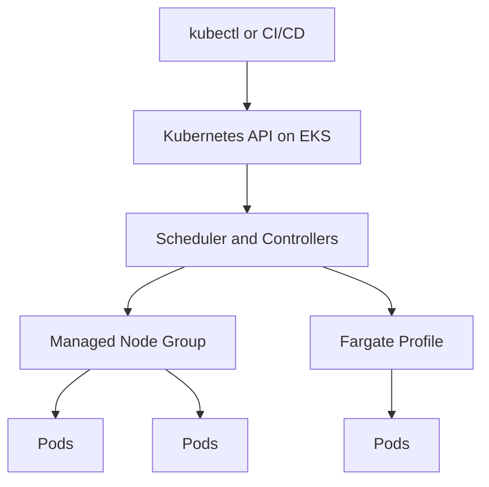

# Amazon EKS

## What It Is

Amazon Elastic Kubernetes Service (EKS) is AWS's managed Kubernetes service. It runs the Kubernetes control plane for you while allowing you to run worker nodes on EC2 or pods on [[AWS Fargate]].

## Why It Exists

Kubernetes has become a common orchestration standard, but operating its control plane is non-trivial. EKS lets teams use Kubernetes while offloading core control plane management to AWS.

## Core Concepts

- Cluster
- Node group
- Pod
- Deployment
- Service
- Ingress
- kubelet, CNI, CSI

## How It Works

AWS runs the Kubernetes control plane. Your workloads run on worker nodes or Fargate profiles. You interact with the cluster using standard Kubernetes tooling.

## When To Use

Use EKS when you need Kubernetes compatibility, ecosystem tools such as Helm and operators, or want to build platform abstractions around Kubernetes APIs.

## When Not To Use

If your team mainly wants containers without Kubernetes complexity, consider [[Amazon ECS]]. If the workload is small and operational simplicity matters most, EKS is often too much platform.

## Common Use Cases

- Large microservice platforms
- Multi-team container platforms
- Hybrid or multi-environment Kubernetes estates
- Internal developer platforms

## Operations And Cost Considerations

EKS reduces control plane work, not Kubernetes complexity. You still manage cluster add-ons, networking, IAM integration, security, and workload design. Costs include the EKS control plane plus worker nodes or Fargate.

## Common Mistakes

- Choosing EKS because Kubernetes is standard without a clear platform need
- Underestimating operational overhead
- Poor resource request and limit discipline
- Ignoring upgrade compatibility across add-ons and versions

## Practical Example

A company has multiple product teams that already use Helm charts and need standardized deployment workflows across environments. They choose EKS because they need admission controls, namespace isolation, and platform tooling around Kubernetes APIs.

## Related Notes

- [[Amazon ECS]]
- [[AWS Fargate]]
- [[Elastic Load Balancing (ELB)]]
- [[Amazon ECR]]
- [[Amazon EC2]]
