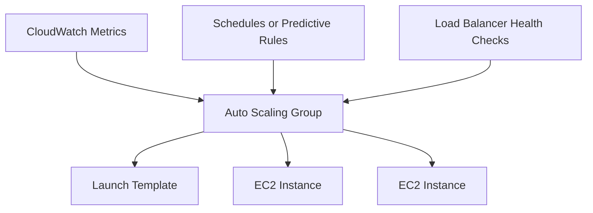

# EC2 Auto Scaling

## What It Is

EC2 Auto Scaling automatically adds or removes EC2 instances based on demand, health signals, or schedules. Its primary job is to maintain the right amount of compute capacity for a fleet of EC2 instances.

## Why It Exists

Running the correct number of servers manually is slow and error-prone. Auto Scaling matches infrastructure to changing demand, improves availability by replacing unhealthy instances, and reduces cost by scaling in when demand falls.

## Core Concepts

- Auto Scaling Group
- Launch template
- Desired, minimum, and maximum capacity
- Health checks
- Scaling policies
- Cooldown and warmup

## How It Works

You define an Auto Scaling group and a launch template. The group runs across one or more subnets, usually in multiple Availability Zones. CloudWatch metrics, schedules, or predictive models drive scaling decisions.

## When To Use

Use EC2 Auto Scaling for stateless or mostly replaceable EC2-based applications, self-healing fleets, and workloads that need to scale across multiple Availability Zones.

## When Not To Use

If the workload is truly stateful and cannot tolerate replacement without coordination, Auto Scaling may be a poor fit. If you need container scheduling rather than instance fleet management, use [[Amazon ECS]] or [[Amazon EKS]].

## Common Use Cases

- Web server fleets behind an ALB
- API workers
- Queue consumers
- Scheduled scale-out for business hours
- Mixed On-Demand and Spot fleets

## Operations And Cost Considerations

Instance launch must be deterministic. Startup scripts must be idempotent. Use instance refresh to roll out AMI changes safely. Overly aggressive policies can cause flapping. Mixed instance policies and Spot can reduce cost.

## Common Mistakes

- Scaling on CPU when the real bottleneck is a database or downstream dependency
- Using health checks that mark instances healthy before the app is ready
- Keeping session state on instances behind a load balancer
- Not testing scale-in behavior

## Practical Example

An e-commerce API runs on EC2 behind an ALB with minimum 4 instances, maximum 30, target tracking at 50 percent CPU, and ALB health checks on `/health`. During a flash sale, the group launches more instances automatically and scales back in after traffic drops.

## Related Notes

- [[Amazon EC2]]
- [[Elastic Load Balancing (ELB)]]
- [[EC2 Placement Groups]]
- [[AWS Lambda]]
- [[Amazon ECS]]
