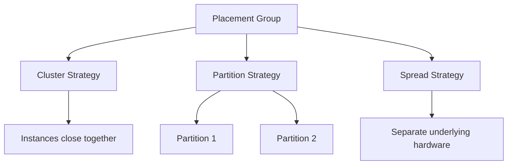

# EC2 Placement Groups

## What It Is

EC2 Placement Groups are a way to influence how EC2 instances are placed on underlying AWS infrastructure to optimize for low latency, high throughput, or reduced correlated failure.

## Why It Exists

Default AWS placement is designed for general-purpose availability and flexibility. Some workloads need stronger control over physical proximity or separation.

## Core Concepts

- Cluster placement group
- Partition placement group
- Spread placement group

## How It Works

When you launch instances into a placement group, AWS applies placement rules to influence physical host or rack decisions.

## When To Use

Use placement groups for high-performance computing, low-latency distributed systems, large clustered data systems, and small critical fleets where host-level separation matters.

## When Not To Use

Do not use placement groups for general application fleets that do not have a clear placement requirement.

## Common Use Cases

- HPC workloads
- Real-time analytics clusters
- Distributed databases or data nodes
- Critical replicated controller nodes

## Operations And Cost Considerations

Placement constraints can affect launch success if capacity is tight. Cluster groups are usually AZ-specific design decisions. The real impact is architectural rather than a separate direct billing line.

## Common Mistakes

- Using placement groups without a measurable need
- Assuming a placement group alone provides application resilience
- Ignoring capacity planning for cluster placement

## Practical Example

A distributed analytics engine runs on EC2 instances that exchange large amounts of data between nodes. The team uses a cluster placement group within one AZ to reduce latency and improve throughput between worker nodes.

## Related Notes

- [[Amazon EC2]]
- [[EC2 Auto Scaling]]
- [[Elastic Load Balancing (ELB)]]
- [[Amazon ECS]]
- [[Amazon EKS]]
