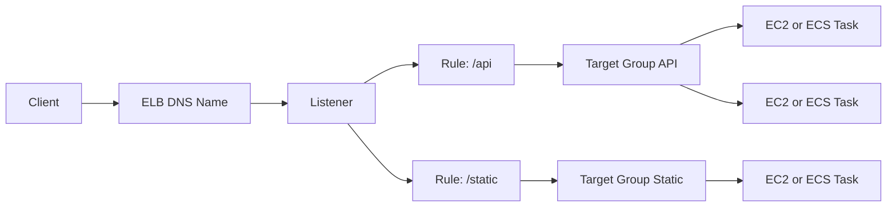

# Elastic Load Balancing (ELB)

## What It Is

Elastic Load Balancing distributes incoming traffic across multiple targets such as EC2 instances, containers, IP addresses, and Lambda functions. The main load balancer families are Application Load Balancer, Network Load Balancer, and Gateway Load Balancer.

## Why It Exists

A load balancer provides a stable entry point while hiding the changing set of backend compute resources. It improves availability, enables horizontal scaling, and centralizes TLS termination and routing logic.

## Core Concepts

- Listener
- Target group
- Health check
- ALB
- NLB
- GWLB

## How It Works

Clients send requests to the load balancer DNS name. The load balancer evaluates listeners and rules, selects a healthy target from the appropriate target group, and forwards traffic.

## When To Use

Use ELB when you need high availability across multiple backends, a single endpoint for a distributed application, or HTTP routing features and health-based load distribution.

## When Not To Use

If your traffic pattern is trivial and a simpler direct connection is acceptable, a load balancer may be unnecessary. For global traffic management across regions, use Route 53 or Global Accelerator in addition.

## Common Use Cases

- Internet-facing web applications
- Internal service load balancing
- Container ingress for [[Amazon ECS]] and [[Amazon EKS]]
- TLS termination for EC2 services

## Operations And Cost Considerations

Health check design is critical. Idle timeouts, connection draining, and deregistration delay affect rollout behavior. Costs vary by load balancer type and processed traffic.

## Common Mistakes

- Choosing ALB when NLB semantics are required, or the reverse
- Using shallow health checks that do not represent real application readiness
- Treating the load balancer as the full security boundary instead of layering controls

## Practical Example

A company runs `/app` traffic to a React and API backend and `/admin` traffic to a separate admin service. An ALB fronts all services, uses path-based routing, terminates TLS with ACM, and sends traffic to separate target groups.

## Related Notes

- [[Amazon EC2]]
- [[EC2 Auto Scaling]]
- [[Amazon ECS]]
- [[Amazon EKS]]
- [[AWS Lambda]]
