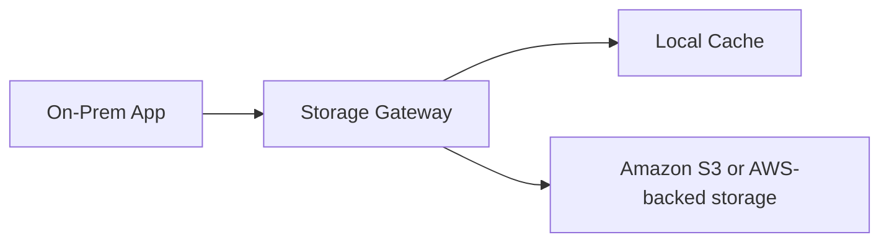

# AWS Storage Gateway

## What It Is

AWS Storage Gateway is a hybrid storage service that connects on-premises environments to AWS storage services such as [[Amazon S3]] and AWS-backed storage patterns.

## Why It Exists

Many organizations cannot move everything to the cloud immediately. Storage Gateway bridges local infrastructure with AWS storage without forcing a full rewrite first.

## Core Concepts

- Hybrid access
- Caching
- Gateway types
- Migration path

## How It Works

A gateway appliance or VM runs on-premises and exposes storage interfaces locally while integrating with AWS in the background.

## When To Use

Use Storage Gateway when you need hybrid cloud storage integration, cloud-backed backups from on-prem systems, local access with cloud durability, or gradual migration from legacy environments.

## When Not To Use

Do not use Storage Gateway when the application already runs fully in AWS or when native direct access to S3 is possible and simpler.

## Common Use Cases

- Backing up on-prem file servers into AWS
- Replacing tape workflows
- Extending local file shares with cloud-backed storage
- Supporting hybrid DR patterns

## Cost And Operations

Costs include gateway usage model, backing AWS storage, data transfer, and potential local infrastructure cost. Ensure reliable connectivity and size local cache correctly.

## Common Mistakes

- Treating hybrid as simpler than it is
- Under-sizing cache or bandwidth
- Ignoring recovery runbooks
- Using Storage Gateway when direct S3 integration would be simpler

## Practical Example

A company has an on-prem backup application that writes to virtual tape. Instead of buying more physical tape infrastructure, it uses Storage Gateway to present a compatible interface while storing durable backup data in AWS.

## Related Notes

- [[Amazon S3]]
- [[Amazon EBS]]
- [[Amazon EFS]]
