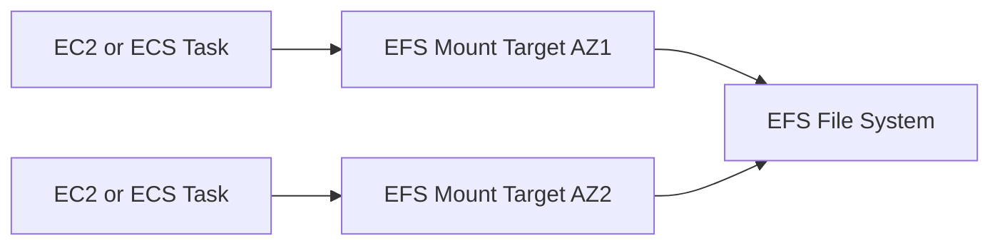

# Amazon EFS

## What It Is

Amazon EFS is a managed, elastic network file system for Linux workloads on AWS. It provides shared file storage that multiple instances can mount at the same time.

## Why It Exists

Some applications need a shared filesystem rather than object or block storage. EFS provides shared access across many compute nodes, POSIX-style semantics, and elastic growth without manual resizing.

## Core Concepts

- Shared filesystem
- NFS protocol
- Regional service
- Elastic capacity
- Performance modes and throughput

## How It Works

Clients mount EFS over the network and access it like a standard Linux filesystem.

## When To Use

Use EFS when you need shared filesystem access, Linux file semantics, auto-scaling file storage, or multi-instance application file sharing.

## When Not To Use

Do not use EFS when you need highest single-instance block performance, Windows-native filesystem features, or object storage economics for huge archives.

## Common Use Cases

- Shared web content
- CMS media storage
- Shared datasets for analytics or ML
- Containerized application shared config and data

## Cost And Operations

Cost factors include stored data, storage tier choices, throughput model, and backup features. Design network access correctly and understand performance mode selection.

## Common Mistakes

- Using EFS for workloads that really need local block storage
- Ignoring NFS latency characteristics
- Assuming Windows compatibility like SMB
- Treating EFS as cheap archive storage compared with S3

## Practical Example

A fleet of web servers serves uploaded images. All servers mount the same EFS filesystem so uploads appear instantly across the fleet without syncing local disks.

## Related Notes

- [[Amazon EBS]]
- [[Amazon FSx]]
- [[Amazon S3]]
