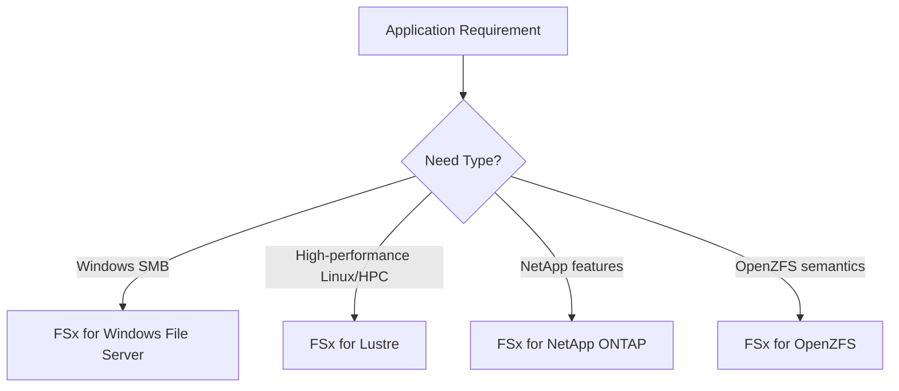

# Amazon FSx

## What It Is

Amazon FSx is a family of managed file system services for specialized workloads. It offers purpose-built file systems such as FSx for Windows File Server, FSx for Lustre, FSx for NetApp ONTAP, and FSx for OpenZFS.

## Why It Exists

Different workloads need different filesystem behaviors. Windows applications may need SMB and Active Directory integration, while HPC workloads may need very high throughput and parallel access.

## Core Concepts

- Specialized file systems
- Managed operations
- Workload alignment by protocol or performance model

## How It Works

Applications connect to the selected FSx file system type using its supported protocol and semantics.

## When To Use

Use FSx when you need Windows file shares, SMB support, Active Directory integration, enterprise NAS capabilities, or specific filesystem semantics not provided by EFS.

## When Not To Use

Do not use FSx when you need only simple shared Linux NFS storage, basic object storage, or a single-instance boot disk.

## Common Use Cases

- Windows home directories and shared drives
- Lift-and-shift Windows applications
- Media rendering or HPC processing
- Enterprise storage migrations needing advanced NAS features

## Cost And Operations

Cost depends on filesystem type, storage capacity, throughput or performance tier, and backup or replication features. Choose based on protocol first, not branding.

## Common Mistakes

- Choosing FSx without a clear protocol requirement
- Using a specialized filesystem where EFS would be simpler
- Ignoring dependency requirements like Active Directory
- Underestimating cost compared to simpler services

## Practical Example

A company migrates a Windows file server to AWS. Users need SMB shares and permissions must work with Active Directory, so the team chooses FSx for Windows File Server instead of EFS.

## Related Notes

- [[Amazon EFS]]
- [[Amazon EBS]]
- [[Amazon S3]]
