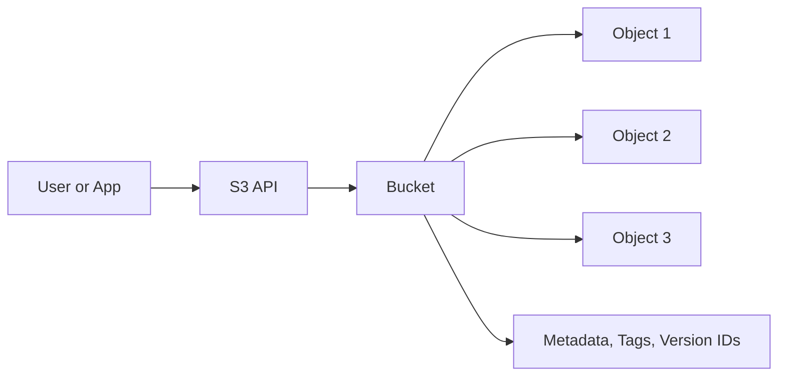

# Amazon S3

## What It Is

Amazon S3 is AWS's regional, highly durable object storage service. It stores data as objects inside buckets, not as files on a mounted filesystem or blocks on a disk.

## Why It Exists

Traditional servers and attached disks are hard to scale for large amounts of unstructured data. S3 provides massive scale without capacity planning, very high durability, simple HTTP-based access, and low operational overhead.

## Core Concepts

- Buckets
- Objects
- Keys
- Versioning
- Durability vs availability
- Storage classes
- Lifecycle policies
- Replication

## How It Works

Applications store and retrieve objects by bucket and key over HTTPS. When you upload an object, S3 distributes and stores it redundantly across multiple AZs in the Region.

## When To Use

Use S3 for durable object storage, static website assets, backups and archives, log storage, media storage, data lakes, and event-driven workflows.

## When Not To Use

Do not use S3 when you need low-latency block storage for EC2 boot volumes, a shared POSIX filesystem, frequent small in-place updates like a database file, or traditional relational queries.

## Common Use Cases

- Static website content
- Backup and restore repositories
- Log and audit data
- Image and video storage
- Data lake staging and analytics
- Software package distribution

## Cost And Operations

Typical cost dimensions include storage used, requests, data transfer out, lifecycle transitions, retrieval fees for some storage classes, and replication if enabled. Enable versioning for important buckets and use lifecycle rules intentionally.

## Common Mistakes

- Treating S3 like a mounted local filesystem
- Forgetting to block public access
- Not enabling versioning before critical workloads
- Ignoring lifecycle cleanup for old data
- Assuming folders are real filesystem directories

## Practical Example

A company stores application logs in S3. The bucket has versioning enabled, a lifecycle rule moves logs to a cheaper class after 30 days, and after 365 days logs are archived or expired.

## Related Notes

- [[S3 Storage Classes]]
- [[S3 Lifecycle]]
- [[S3 Replication (SRR and CRR)]]
- [[Amazon EBS]]
- [[Amazon EFS]]
