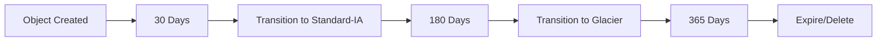

# S3 Lifecycle

## What It Is

S3 Lifecycle is a rule-based automation feature in [[Amazon S3]] that transitions objects between storage classes or expires them after defined time periods.

## Why It Exists

Without automation, old data accumulates and costs grow. Lifecycle policies solve this automatically.

## Core Concepts

- Transition actions
- Expiration actions
- Current and noncurrent versions
- Prefix and tag filters

## How It Works

Lifecycle rules are attached to a bucket. S3 evaluates objects against the rules and performs the action when conditions match.

## When To Use

Use lifecycle for automated cost optimization, backup retention enforcement, log expiration, long-term archive movement, and cleanup of temporary uploads.

## When Not To Use

Do not use lifecycle blindly when objects are business-critical and retention is unclear or when applications depend on immediate availability but data is being archived.

## Common Use Cases

- Delete access logs after 90 days
- Move backups to archive after 30 or 60 days
- Remove incomplete multipart uploads
- Expire old versions in versioned buckets

## Cost And Operations

Lifecycle can reduce storage cost, but transition requests can incur charges, archive retrieval may cost more later, and minimum duration rules still apply.

## Common Mistakes

- Deleting data too aggressively
- Archiving data that still needs frequent reads
- Forgetting noncurrent version growth in versioned buckets
- Creating rules without matching recovery needs

## Practical Example

A product team stores daily CSV exports: keep them in S3 Standard for 14 days, move them to S3 Glacier Instant Retrieval after day 15, and delete after one year.

## Related Notes

- [[Amazon S3]]
- [[S3 Storage Classes]]
- [[S3 Replication (SRR and CRR)]]
