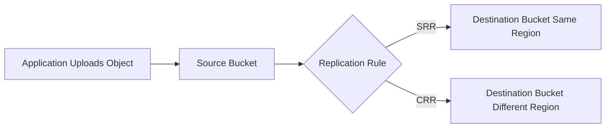

# S3 Replication

## What It Is

S3 Replication automatically copies objects from one S3 bucket to another. It supports Same-Region Replication (SRR) and Cross-Region Replication (CRR).

## Why It Exists

Replication exists to support disaster recovery, data locality, compliance requirements, cross-account data sharing, and separate analytics or backup copies.

## Core Concepts

- Source and destination buckets
- Versioning requirement
- SRR
- CRR
- Replication scope
- Ownership and encryption considerations

## How It Works

When a new object is written to the source bucket, S3 asynchronously replicates it according to the rule.

## When To Use

Use replication when you need DR copies in another Region, separate copies for another account, regulatory separation, analytics bucket isolation, or centralized logging.

## When Not To Use

Do not use replication when a single bucket is sufficient, when you expect synchronous multi-region writes, or when cost sensitivity is very high and duplicated storage is unnecessary.

## Common Use Cases

- Production assets copied to a secondary Region
- Security logs copied to a locked audit account
- Shared datasets copied into a separate consumer account
- Replicating uploads closer to regional consumers

## Cost And Operations

Replication adds cost through additional storage, replication requests, inter-region transfer for CRR, and KMS costs if encryption is involved. Monitor replication status and validate permissions early.

## Common Mistakes

- Forgetting to enable versioning
- Assuming old objects are automatically backfilled
- Missing KMS permissions
- Replicating deletes unintentionally
- Treating replication as a full DR strategy without testing recovery processes

## Practical Example

A media platform uploads originals to a bucket in `us-east-1` and enables CRR to `eu-west-1` so Europe has a local copy and the company has a second-region resilience layer.

## Related Notes

- [[Amazon S3]]
- [[S3 Lifecycle]]
- [[S3 Storage Classes]]
