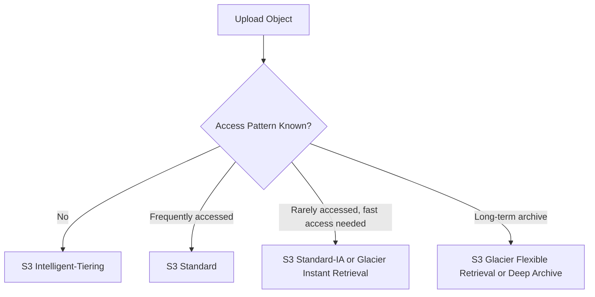

# S3 Storage Classes

## What It Is

S3 storage classes are pricing and access tiers for objects stored in [[Amazon S3]]. They let you optimize cost based on access frequency, retrieval speed, and resilience requirements.

## Why It Exists

Not all data is accessed equally. Some data is read constantly, some is rarely touched, and some must be kept for years only for compliance. Storage classes align storage cost with real access patterns.

## Core Concepts

- Frequent access vs infrequent access
- Retrieval time
- Minimum storage duration
- Availability and AZ placement

## Main Storage Classes

- S3 Standard
- S3 Intelligent-Tiering
- S3 Standard-IA
- S3 One Zone-IA
- S3 Glacier Instant Retrieval
- S3 Glacier Flexible Retrieval
- S3 Glacier Deep Archive

## How It Works

Each object has a storage class. Objects can be placed directly into a class or transitioned later using [[S3 Lifecycle]].

## When To Use

Use storage classes to lower storage cost, match access needs to storage design, and improve archive strategy.

## When Not To Use

Do not optimize too early when the access pattern is unknown and the data set is small or when retrieval charges could outweigh storage savings.

## Common Use Cases

- Standard for active application assets
- Intelligent-Tiering for unpredictable access patterns
- Standard-IA for monthly reports or backups
- One Zone-IA for recreatable secondary copies
- Glacier classes for compliance archives and historical records

## Cost And Operations

Cost factors differ by class: storage price per GB, retrieval fees, monitoring/automation charges for Intelligent-Tiering, and minimum object size or duration rules. Test restore times for archive classes before depending on them.

## Common Mistakes

- Moving frequently accessed data into IA or Glacier too early
- Ignoring minimum storage duration charges
- Assuming all Glacier options retrieve immediately
- Using One Zone-IA for irreplaceable data

## Practical Example

A SaaS company stores customer exports: new exports stay in S3 Standard for 7 days, then move to S3 Standard-IA for 90 days, then move to S3 Glacier Deep Archive for long-term retention.

## Related Notes

- [[Amazon S3]]
- [[S3 Lifecycle]]
- [[S3 Replication (SRR and CRR)]]
