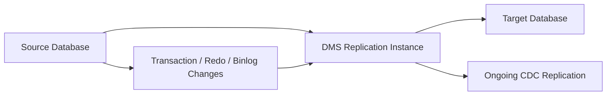

---
tags:
  - aws
  - database
  - migration
  - dms
aliases:
  - AWS DMS
  - Database Migration Service
---

# AWS Database Migration Service (DMS)

## What It Is

AWS Database Migration Service (DMS) is a managed service for migrating and replicating data between databases, data warehouses, and other supported data stores. It helps move data from a source system to a target system with minimal downtime.

## Why It Exists

Moving databases is hard because production systems cannot usually stop for long. DMS reduces migration pain by handling initial full data loads, ongoing change replication, and low-downtime cutovers.

## Core Concepts

- Source and target endpoints
- Replication instance
- Replication task
- Change data capture (CDC)
- Schema conversion distinction with AWS SCT
- Homogeneous vs heterogeneous migration

## How It Works

You create source and target endpoints, provision a replication instance, and run a task in full load, CDC, or full load plus CDC mode.

## When To Use

Use DMS when you need low-downtime database migration, ongoing replication between systems, or a staged migration from on-premises to AWS.

## When Not To Use

Do not use DMS when you only need a one-time manual export/import of a small dataset or expect DMS to fully convert complex schema and application logic by itself.

## Common Use Cases

- On-prem Oracle to Amazon RDS or Aurora migration
- SQL Server to Amazon RDS migration
- Cross-region or cross-platform database migration
- Continuous replication into analytics targets

## Cost And Operations

Main cost areas are replication instance hours, storage, logging, and network transfer. You still need to plan connectivity, source log retention, target capacity, task tuning, validation, and cutover sequencing.

## Common Mistakes

- Assuming DMS converts everything automatically in heterogeneous migrations
- Forgetting to use AWS SCT where schema conversion is needed
- Under-sizing the replication instance
- Not enabling or retaining source logs required for CDC
- Skipping data validation before cutover

## Practical Example

A company moves a production Oracle database on-premises to Aurora PostgreSQL with minimal downtime. They use AWS SCT for schema assessment, run a DMS full load plus CDC task, validate the target, then cut application traffic over after replication lag drains.

## Related Notes

- [[Amazon RDS]]
- [[Amazon Aurora]]
- [[AWS Migration Hub]]
- [[AWS Application Migration Service (MGN)]]
