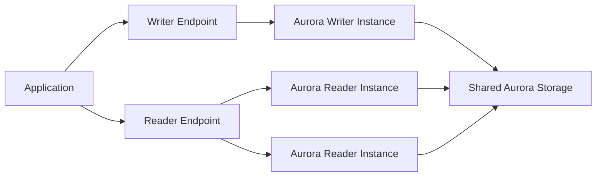

# Amazon Aurora

## What It Is

Amazon Aurora is AWS's cloud-optimized relational database engine, compatible with popular relational database ecosystems while providing AWS-managed high availability and performance-oriented architecture.

## Why It Exists

Traditional relational engines were not originally designed around cloud-native distributed storage. Aurora provides managed relational compatibility with better cloud-scale resilience and read scaling.

## Core Concepts

- Cluster architecture
- Shared storage layer
- Failover
- Read scaling via reader endpoints

## How It Works

Aurora compute nodes access shared cluster storage. This allows faster recovery and better HA patterns than more traditional single-node storage designs.

## When To Use

Use Aurora when you need relational SQL semantics, managed HA and failover, better cloud-native scaling characteristics, and clustered read scaling.

## When Not To Use

Do not use Aurora when a simpler and cheaper RDS deployment is enough or when the workload is really key-value, cache, graph, or warehouse oriented.

## Common Use Cases

- High-traffic web apps
- SaaS platforms
- Transaction-heavy backend systems
- Read-scaled application databases

## Cost And Operations

Cost factors include compute instances, cluster storage, I/O and backup consumption, replicas, and cross-region features. Endpoint usage and replica design must be intentional.

## Common Mistakes

- Assuming Aurora solves poor schema design
- Sending write traffic to reader endpoints
- Overprovisioning replicas without a clear read pattern
- Ignoring cost compared with simpler RDS options

## Practical Example

A SaaS application needs relational data integrity, managed high availability, and read scaling for dashboards and APIs. Aurora fits well because the writer handles transactions while readers serve reporting and user reads.

## Related Notes

- [[Amazon RDS]]
- [[Amazon DynamoDB]]
- [[Amazon ElastiCache]]
