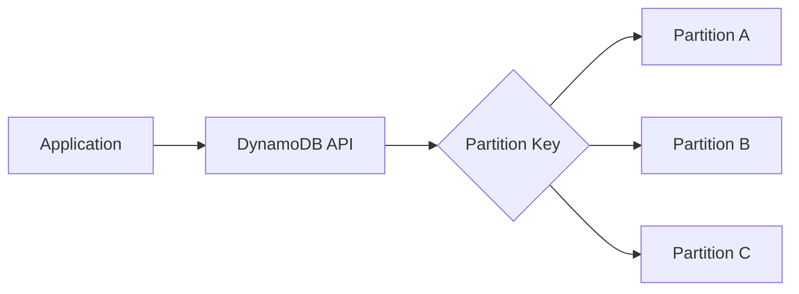

# Amazon DynamoDB

## What It Is

Amazon DynamoDB is AWS's managed NoSQL database service for key-value and document workloads. It is designed for very high scale, low latency, and minimal operational overhead.

## Why It Exists

Many modern applications need database behavior that is different from traditional SQL systems: massive request rates, flexible access patterns, horizontal scaling, and simple operations.

## Core Concepts

- Tables, items, and attributes
- Primary key design
- Access pattern design
- Secondary indexes
- Partitioning
- Capacity modes

## How It Works

Applications read and write items via API calls. DynamoDB distributes partitions behind the scenes and replicates data for durability within the Region.

## When To Use

Use DynamoDB when you need very high scale, low-latency key-based access, flexible NoSQL schema, event-driven architectures, and fully managed serverless-friendly storage.

## When Not To Use

Do not use DynamoDB when you need complex ad hoc joins, deep relational reporting, traditional SQL-first modeling, graph traversal, or warehouse analytics.

## Common Use Cases

- User profile storage
- Shopping cart and session state
- IoT event metadata
- Gaming leaderboards
- Serverless backends

## Cost And Operations

Cost factors include read/write capacity or on-demand requests, storage, secondary indexes, streams, and backups. Design keys carefully, watch for hot partitions, and minimize unnecessary scans.

## Common Mistakes

- Modeling it like a relational database
- Relying on scans instead of key-based access
- Choosing poor partition keys
- Adding GSIs without cost awareness

## Practical Example

An ecommerce service stores carts in DynamoDB using `customerId` as the partition key. Reads and writes are simple and fast, and the application does not need joins across many tables.

## Related Notes

- [[DynamoDB Global Tables]]
- [[Amazon RDS]]
- [[Amazon ElastiCache]]
