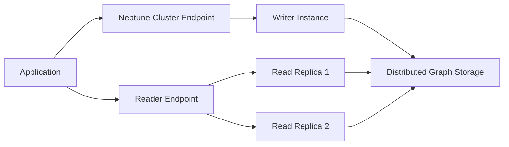

---
tags:
  - aws
  - database
  - graph-database
  - neptune
aliases:
  - Neptune
---

# Amazon Neptune

## What It Is

Amazon Neptune is a fully managed graph database service on AWS. It supports property graph workloads with Gremlin and RDF graph workloads with SPARQL.

## Why It Exists

Traditional relational databases become awkward when queries need to traverse many connected relationships. Neptune solves problems like shortest-path analysis, fraud rings, recommendation paths, and knowledge graphs.

## Core Concepts

- Graph database
- Property graph
- RDF graph
- Cluster
- Endpoints
- Storage and replication
- Query engines

## How It Works

You create a Neptune cluster, choose instance size and networking settings, load graph data, and query it through cluster endpoints. Read replicas can scale read-heavy traffic.

## When To Use

Use Neptune when relationships are first-class data, you need multi-hop traversals, or you are modeling networks, hierarchies, or connected entities.

## When Not To Use

Do not use Neptune when your data is mostly simple tabular records, standard relational queries are enough, or you mostly do key-value lookups.

## Common Use Cases

- Fraud detection
- Social graphs
- Recommendation engines
- Knowledge graphs
- IT dependency mapping

## Cost And Operations

Neptune cost usually comes from DB instance hours, storage, I/O, backups, and read replicas. You still manage data modeling choices, query efficiency, instance sizing, and network design.

## Common Mistakes

- Using Neptune when a relational database is enough
- Poor graph modeling that creates noisy or overly dense relationships
- Treating graph queries like SQL joins
- Not planning VPC access correctly

## Practical Example

A fraud team models customers, devices, cards, IP addresses, and orders as a graph to find shared devices across multiple customers and indirect suspicious connections.

## Related Notes

- [[Amazon RDS]]
- [[Amazon Aurora]]
- [[Amazon DynamoDB]]
