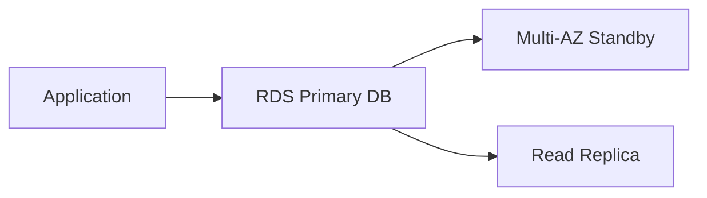

# Amazon RDS

## What It Is

Amazon RDS is AWS's managed relational database service. It automates much of the infrastructure work required to run traditional SQL databases.

## Why It Exists

Teams often want relational databases without managing server provisioning, OS patching, database installation, basic backups, and failover infrastructure.

## Core Concepts

- Relational model
- Managed service
- Multi-AZ
- Read replicas
- Backups and snapshots

## How It Works

Applications connect to the RDS endpoint over the network just like a normal database. AWS runs and manages the database instance environment.

## When To Use

Use RDS when you need SQL, ACID transactions, joins and relational integrity, managed operations, and standard application databases.

## When Not To Use

Do not use RDS when you need massive flexible key-value scale, ultra-low-latency in-memory caching, graph traversal workloads, or analytics warehouse patterns.

## Common Use Cases

- Web application backends
- ERP and CRM databases
- Transactional services
- User, account, and order systems
- Lift-and-shift SQL workloads

## Cost And Operations

Cost drivers include instance class, storage type and size, IOPS tier, backup retention, Multi-AZ, and read replicas. Managed does not mean no tuning is needed.

## Common Mistakes

- Assuming managed means no tuning needed
- Ignoring connection limits
- Not planning maintenance windows
- Confusing Multi-AZ with read scaling

## Practical Example

An ecommerce application stores customers, orders, and payments in RDS because transactions matter, data relationships are important, SQL reporting is needed, and backups and HA should be managed.

## Related Notes

- [[Amazon Aurora]]
- [[Amazon DynamoDB]]
- [[Amazon ElastiCache]]
- [[Amazon Redshift]]
