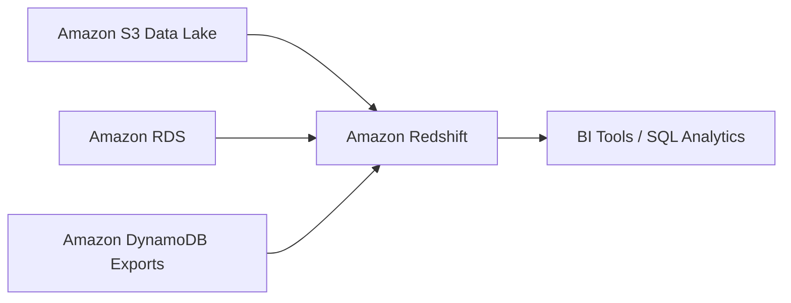

# Amazon Redshift

## What It Is

Amazon Redshift is AWS's managed data warehouse service for large-scale analytics using SQL.

## Why It Exists

Operational databases like [[Amazon RDS]] and [[Amazon DynamoDB]] are designed for transactional application traffic, not large analytical scans across huge historical datasets. Redshift supports complex analytics queries, large aggregations, and business intelligence workloads.

## Core Concepts

- Data warehouse
- Columnar storage
- OLAP vs OLTP
- ETL and ELT patterns
- Separation between operational and analytical systems

## How It Works

Data is ingested into Redshift and queried by analysts, dashboards, and BI tools.

## When To Use

Use Redshift when you need large-scale analytics, SQL-based reporting, historical aggregations, BI dashboard backends, or a centralized data warehouse.

## When Not To Use

Do not use Redshift when you need high-volume transactional writes for an application, millisecond key-value lookups, graph traversal, or session caching.

## Common Use Cases

- Executive reporting
- Customer behavior analytics
- Sales and finance dashboards
- Centralized data warehouse
- Operational data offloading for analytics

## Cost And Operations

Cost factors include compute capacity, storage, data loading and movement patterns, and backup retention. Model for analytics, not OLTP, and manage query performance and concurrency.

## Common Mistakes

- Using Redshift as the primary application database
- Loading poorly modeled operational data without transformation
- Expecting OLTP-style low-latency row updates
- Ignoring warehouse cost during idle periods

## Practical Example

A retail company loads daily orders, product data, and clickstream summaries into Redshift. Business analysts query revenue by region, product category, and month without impacting the production application database.

## Related Notes

- [[Amazon RDS]]
- [[Amazon Athena]]
- [[AWS Glue]]
- [[Amazon EMR]]
