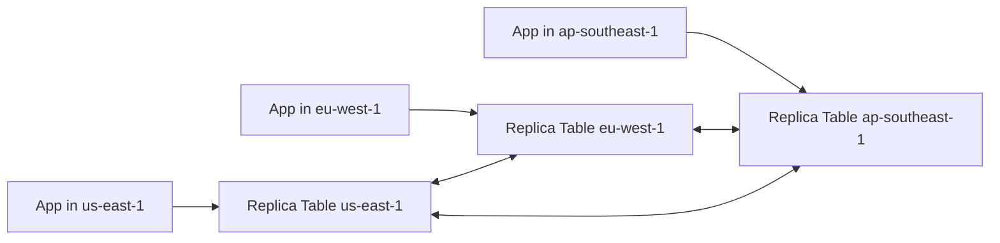

# DynamoDB Global Tables

## What It Is

DynamoDB Global Tables extend [[Amazon DynamoDB]] across multiple AWS Regions by replicating table data between them.

## Why It Exists

Global applications may need low-latency access for users in different Regions, regional resilience, and multi-region active-active architecture.

## Core Concepts

- Multi-Region replication
- Active-active design
- Eventual cross-region convergence
- Conflict resolution considerations

## How It Works

Each Region has a replica table. DynamoDB replicates changes among them.

## When To Use

Use Global Tables when you need multi-region low-latency user access, regional failover support, and globally distributed active-active applications.

## When Not To Use

Do not use Global Tables when one Region is enough, the app cannot tolerate replication conflict complexity, or strong single-writer consistency across Regions is required.

## Common Use Cases

- Global user profile services
- Multiplayer game state metadata
- Multi-region SaaS control planes
- Regionally local session systems

## Cost And Operations

Writes replicate to multiple Regions, storage is duplicated in each Region, and monitoring across Regions becomes more complex. Test failover and conflict behavior explicitly.

## Common Mistakes

- Assuming synchronous global consistency
- Ignoring conflict scenarios
- Enabling multi-region writes without application-level design
- Forgetting cost multiplies by Region count

## Practical Example

A global SaaS product stores tenant configuration in Global Tables so US users are served primarily from `us-east-1`, EU users from `eu-west-1`, and updates replicate between them.

## Related Notes

- [[Amazon DynamoDB]]
- [[Amazon Aurora]]
- [[S3 Replication (SRR and CRR)]]
