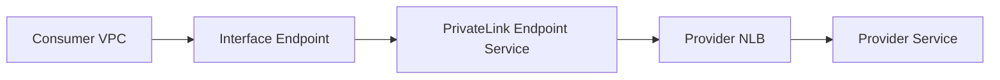

# AWS PrivateLink

## What It Is

AWS PrivateLink provides private connectivity to services over AWS’s network without exposing traffic to the public internet and without requiring broad VPC-to-VPC routing.

## Why It Exists

Sometimes consumers need private access to a service, but full network peering is too open, too complex, or not allowed.

## Core Concepts

- Service provider exposes a service behind an NLB
- Consumer creates interface VPC endpoints
- Private IP connectivity inside the consumer VPC
- One-way service consumption model

## How It Works

A provider publishes an endpoint service. A consumer creates an interface endpoint in selected subnets. Traffic from the consumer reaches the provider service privately through AWS-managed networking.

## When To Use

Use PrivateLink for private consumption of shared services, SaaS integrations, cross-account service exposure with limited network access, or accessing AWS APIs without NAT.

## When Not To Use

Do not use PrivateLink when full bidirectional VPC connectivity is needed or when simple peering is enough and acceptable.

## Common Use Cases

- Private access to internal APIs across accounts
- Access to AWS services like SSM, Secrets Manager, or CloudWatch Logs without NAT
- Private SaaS consumption

## Security And Operations Considerations

PrivateLink provides strong isolation compared to peering. Interface endpoints have hourly and data processing charges. DNS configuration is important for endpoint-based resolution.

## Common Mistakes

- Expecting full network reachability
- Forgetting DNS configuration
- Using NAT for AWS APIs that could use interface endpoints instead

## Practical Example

Private EC2 instances reach Systems Manager through interface endpoints so they do not need internet or NAT access.

## Related Notes

- [[Amazon VPC]]
- [[NAT Gateway and NAT Instances]]
- [[AWS Transit Gateway]]
- [[AWS Systems Manager]]
