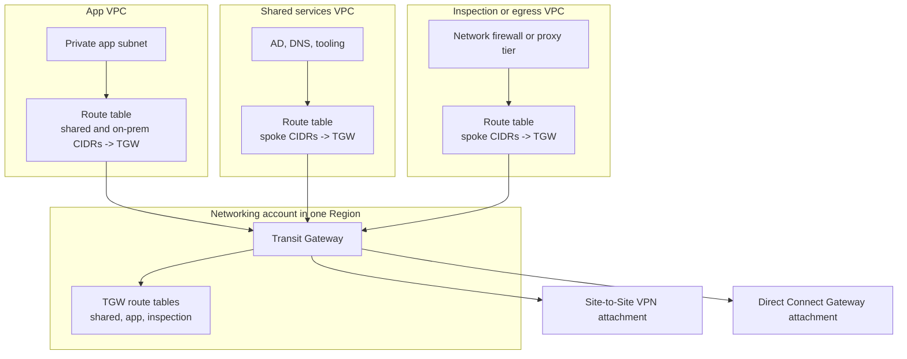

# AWS Transit Gateway

## What It Is

AWS Transit Gateway is a hub-and-spoke network transit service connecting VPCs, VPNs, and Direct Connect gateways.

## Why It Exists

Many organizations outgrow VPC peering meshes. They need centralized, scalable routing and hybrid connectivity.

## Core Concepts

- Hub-and-spoke model
- Attachments for VPCs, VPNs, and DX
- TGW route tables
- Regional service with inter-region peering

## How It Works

You attach networks to the TGW. Routes are propagated or statically added into TGW route tables. Each attachment can be associated with a route table to control which destinations it can reach.

## When To Use

Use Transit Gateway for many VPCs, hybrid WAN connectivity, centralized network architecture, and segmented routing domains.

## When Not To Use

Do not use Transit Gateway for very small setups where simple peering is enough and cheaper.

## Common Use Cases

- Multi-account landing zone networking
- Centralized egress and inspection
- Branch and data center connectivity

## Security And Operations Considerations

Transit Gateway is charged per attachment and per GB. It is powerful but easy to overcomplicate. Use separate TGW route tables for segmentation.

## Common Mistakes

- Treating TGW like a firewall
- Poor route-domain design
- Ignoring asymmetric routing risks with inspection architectures
- Not planning CIDRs centrally

## Practical Example

A central networking account hosts a TGW connecting app VPCs, a shared services VPC, and on-premises VPN attachments.

## Related Notes

- [[VPC Peering]]
- [[AWS Direct Connect]]
- [[AWS Site-to-Site VPN and Client VPN]]
- [[Amazon VPC]]
