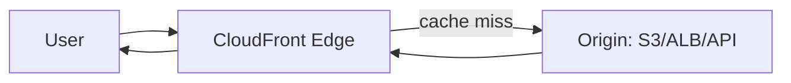

# Amazon CloudFront

## What It Is

Amazon CloudFront is AWS’s global content delivery network for caching and delivering content close to users.

## Why It Exists

Users are geographically distributed. Pulling every request from a single origin increases latency and origin load. CloudFront reduces both.

## Core Concepts

- Edge locations
- Origins
- Behaviors
- TTLs and invalidations
- Origin Access Control
- Integration with WAF, Shield, and edge compute features

## How It Works

A user requests content. DNS points them to a nearby edge location. If the object is cached, CloudFront serves it immediately. Otherwise it fetches from the origin and caches it according to policy.

## When To Use

Use CloudFront for static websites and assets, API acceleration, video and content delivery, or protecting origins from direct public access.

## When Not To Use

Do not rely on CloudFront when the primary need is network-level traffic acceleration with static anycast IPs; use [[AWS Global Accelerator]] instead.

## Common Use Cases

- S3 static site assets
- Fronting ALBs and APIs
- Signed URLs or cookies for private downloads

## Security And Operations Considerations

Cache hit ratio heavily affects cost and performance. Lock down S3 with Origin Access Control. Beware cache-key explosions from too many headers or query strings.

## Common Mistakes

- Misconfigured cache policies causing low hit rates
- Accidentally caching dynamic or user-specific responses
- Leaving origin directly public when it should only accept CloudFront

## Practical Example

A web app serves JS, CSS, and images from CloudFront backed by S3 and routes `/api/*` to an ALB origin with low TTL or no caching.

## Related Notes

- [[Amazon Route 53]]
- [[AWS Global Accelerator]]
- [[Amazon CloudWatch]]
