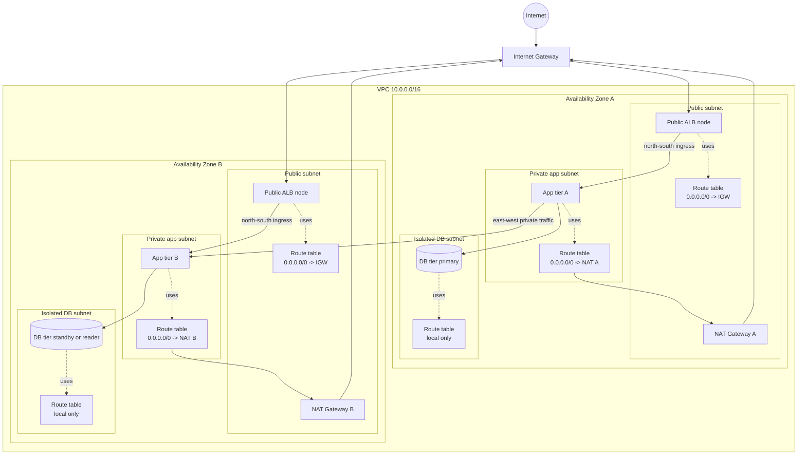

# Amazon VPC

## What It Is

Amazon Virtual Private Cloud (VPC) is a logically isolated network in AWS where you place resources such as EC2 instances, databases, load balancers, and endpoints.

## Why It Exists

AWS needs a way to give each customer private network boundaries, IP addressing control, routing, and security controls without requiring dedicated physical hardware.

## Core Concepts

- CIDR block
- Subnets
- Route tables
- Internet Gateway
- NAT Gateway
- Security Groups
- Network ACLs
- VPC endpoints
- Peering, Transit Gateway, and PrivateLink

## How It Works

A VPC is created in a Region and spans all AZs in that Region. You divide it into subnets, attach route tables, and decide which resources are reachable from the internet, from other VPCs, or only privately.

## When To Use

Use a VPC for almost all AWS infrastructure needing network isolation, multi-tier applications, hybrid connectivity, or strict segmentation by environment or trust boundary.

## When Not To Use

Some fully managed serverless services do not require VPC placement. Adding a VPC where it provides no connectivity or security value can increase complexity.

## Common Use Cases

- Public web tier with private app and database tiers
- Shared services VPC
- Inspection VPC with centralized egress
- Hybrid enterprise networking

## Security And Operations Considerations

Plan IP ranges early to avoid overlapping CIDRs later. Enable VPC Flow Logs when you need traffic visibility. Prefer private subnets for application and data tiers.

## Common Mistakes

- Picking a CIDR too small for growth
- Overlapping CIDRs across environments
- Putting databases in public subnets
- Assuming security groups alone replace route design

## Practical Example

A three-tier application uses one VPC with public subnets for ALB and NAT Gateway, private subnets for EC2 application servers, isolated private subnets for RDS, and route tables that keep the DB tier off the internet.

## Related Notes

- [[VPC Subnets]]
- [[VPC Route Tables]]
- [[Internet Gateway (IGW)]]
- [[NAT Gateway and NAT Instances]]
- [[Security Groups]]
- [[Network ACLs (NACLs)]]
- [[VPC Peering]]
- [[AWS PrivateLink]]
- [[AWS Transit Gateway]]
