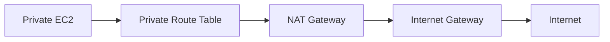

# NAT Gateway and NAT Instances

## What It Is

NAT lets private subnet resources initiate outbound internet connections without accepting unsolicited inbound internet traffic.

## Why It Exists

Private workloads often need software updates, package downloads, or outbound API calls while staying unreachable from the public internet.

## Core Concepts

- NAT Gateway
- NAT Instance
- Private subnet route to NAT
- NAT in a public subnet with an Elastic IP

## How It Works

A private instance sends traffic to its route table. The default route points to the NAT. The NAT translates the source IP to its public address and sends the traffic out through the IGW.

## When To Use

Use NAT for outbound internet access from private EC2 instances or private ECS/EKS workloads that need package repositories or external APIs.

## When Not To Use

Do not use NAT when traffic is mainly to AWS services that support VPC endpoints or when you need inbound internet access.

## Common Use Cases

- Patch downloads from private app servers
- Pulling container images from public registries
- Outbound API integrations from private workloads

## Security And Operations Considerations

NAT Gateway charges hourly plus per-GB data processing. One NAT per AZ is common for resilience and to avoid cross-AZ data charges. NAT Instances require patching and scaling.

## Common Mistakes

- Using one NAT Gateway for all AZs
- Sending S3 or DynamoDB traffic through NAT instead of VPC endpoints
- Forgetting NAT is outbound-only

## Practical Example

A private application tier in two AZs uses two NAT Gateways, one per AZ, with each private subnet routing to the NAT in its own AZ.

## Related Notes

- [[Amazon VPC]]
- [[VPC Route Tables]]
- [[Internet Gateway (IGW)]]
- [[AWS PrivateLink]]
