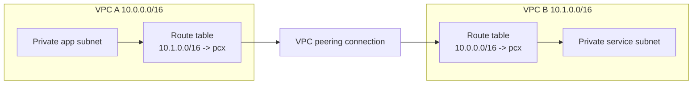

# VPC Peering

## What It Is

VPC Peering connects two VPCs privately so resources can communicate using private IP addresses.

## Why It Exists

Sometimes two VPCs need direct, simple connectivity without traversing the public internet or using a more centralized network hub.

## Core Concepts

- One-to-one connection
- Non-transitive behavior
- Non-overlapping CIDR requirement
- Routes required on both sides

## How It Works

After a peering connection is accepted, each VPC route table must include routes to the other VPC’s CIDR via the peering connection.

## When To Use

Use peering for simple connectivity between a small number of VPCs, including cross-account or cross-region private communication.

## When Not To Use

Do not use peering for large mesh topologies or environments needing transitive routing or centralized inspection; use [[AWS Transit Gateway]] instead.

## Common Use Cases

- Shared services VPC to app VPC
- Dev and test VPC integration
- Cross-account application dependencies

## Security And Operations Considerations

Peering is simpler than Transit Gateway for small scale, but operational burden grows quickly with many VPCs.

## Common Mistakes

- Expecting transitive routing
- Overlapping CIDRs
- Missing route entries or SG rules
- Building a full mesh that becomes hard to manage

## Practical Example

A tools VPC peers with an application VPC so CI runners can reach private app endpoints over private IP.

## Related Notes

- [[Amazon VPC]]
- [[AWS Transit Gateway]]
- [[AWS PrivateLink]]
