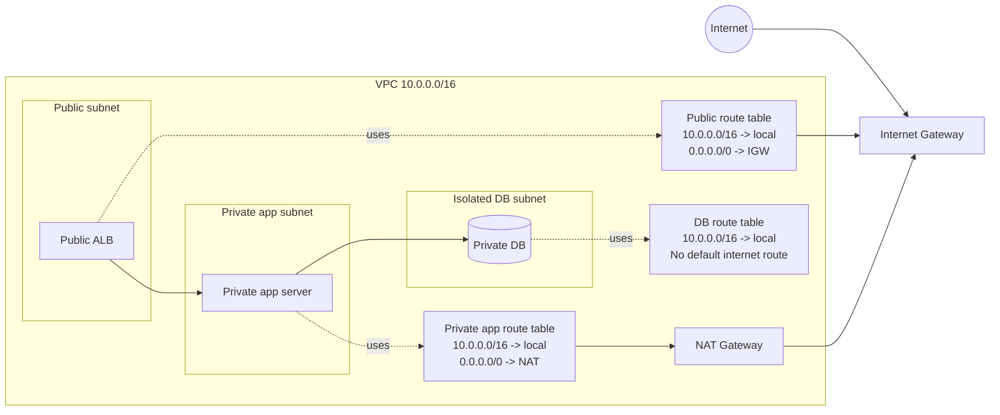

# VPC Route Tables

## What It Is

A route table is a set of rules that tells AWS where network traffic from a subnet or gateway should go.

## Why It Exists

Traffic needs clear forwarding decisions inside and outside a VPC: local traffic, internet traffic, peered VPC traffic, Transit Gateway traffic, endpoint traffic, and more.

## Core Concepts

- Local route
- Default route
- Target
- Main route table
- Subnet association

## How It Works

When a resource sends traffic, AWS matches the most specific route. If a private subnet has `0.0.0.0/0 -> NAT Gateway`, outbound internet traffic leaves through NAT. If a public subnet has `0.0.0.0/0 -> IGW`, traffic can reach the internet directly.

## When To Use

Always use route tables with subnets in a VPC to define internet access, hybrid routes, or inter-VPC connectivity.

## When Not To Use

Do not create many nearly identical route tables unless isolation needs justify them.

## Common Use Cases

- Public subnet route table to IGW
- Private subnet route table to NAT Gateway
- Routes to Transit Gateway for shared networking

## Security And Operations Considerations

Routing is not a firewall. Keep route design documented and be careful that specific routes do not bypass expected paths.

## Common Mistakes

- Assuming route tables filter traffic
- Forgetting to associate the right subnet
- Missing return-path routes in hybrid designs
- Using overlapping CIDRs with peering

## Practical Example

A private application subnet uses `10.0.0.0/16 -> local` and `0.0.0.0/0 -> nat-xxxx` so app servers can download patches without being directly reachable from the internet.

## Related Notes

- [[Amazon VPC]]
- [[VPC Subnets]]
- [[Internet Gateway (IGW)]]
- [[NAT Gateway and NAT Instances]]
- [[AWS Transit Gateway]]
- [[VPC Peering]]
