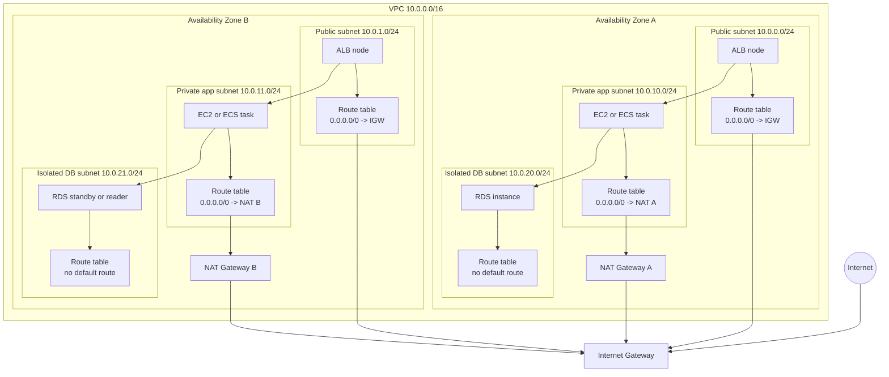

# VPC Subnets

## What It Is

A subnet is a slice of a VPC CIDR block that exists in exactly one Availability Zone.

## Why It Exists

Subnets let you place resources by AZ, isolate tiers, and apply route table and NACL behavior at a smaller network boundary.

## Core Concepts

- AZ-scoped
- Public subnet
- Private subnet
- Isolated subnet
- IP allocation

## How It Works

Resources launched into a subnet get private IP addresses from that subnet’s range. Internet behavior depends on the subnet’s route table, not its name.

## When To Use

Use subnets to separate public and private workloads, spread resources across AZs for high availability, and segment app, DB, and management tiers.

## When Not To Use

Do not create too many tiny subnets without a reason, and do not rely on subnet naming instead of actual routing and security rules.

## Common Use Cases

- Public ALB subnets in two or more AZs
- Private app subnets in each AZ
- Isolated DB subnets for RDS

## Security And Operations Considerations

Route tables and NACLs are subnet-scoped. Keep subnet sizing practical and avoid exhausting IPs.

## Common Mistakes

- Thinking private subnet is a special AWS resource type
- Forgetting that public internet access also depends on public IP assignment
- Using one giant subnet for everything

## Practical Example

A VPC uses `10.0.0.0/24` and `10.0.1.0/24` as public subnets, `10.0.10.0/24` and `10.0.11.0/24` as private app subnets, and `10.0.20.0/24` and `10.0.21.0/24` as private DB subnets.

## Related Notes

- [[Amazon VPC]]
- [[VPC Route Tables]]
- [[Security Groups]]
- [[Network ACLs (NACLs)]]
