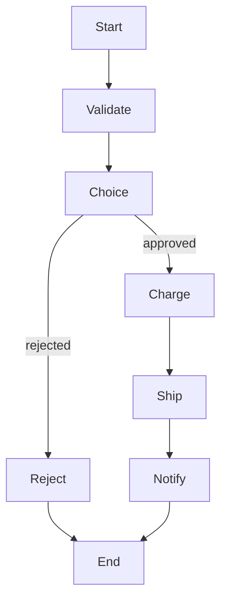

# AWS Step Functions

## What It Is

AWS Step Functions is a managed workflow orchestration service for coordinating tasks, retries, branches, waits, and long-running business processes.

## Why It Exists

Application logic often spans multiple steps and services. Encoding orchestration manually in code becomes fragile and hard to observe.

## Core Concepts

- State machines
- Standard workflows
- Express workflows
- Task, Choice, Parallel, Map, Wait, Pass, Fail, and Succeed states
- Retries and catches

## How It Works

A state machine executes states in order according to the Amazon States Language. Each state can call Lambda, ECS, SDK integrations, or nested workflows.

## When To Use

Use Step Functions for multi-step business processes, human approval or waiting steps, robust retries and error handling, and long-running orchestrations.

## When Not To Use

Do not use it for very simple single-task async work or low-latency inline request paths where orchestration overhead is unnecessary.

## Common Use Cases

- Order fulfillment
- ETL pipelines
- Approval workflows
- Recovery automation

## Security And Operations Considerations

IAM permissions for each task matter. Standard vs Express pricing and behavior differ. Step Functions provide strong observability and failure tracing.

## Common Mistakes

- Putting heavy business logic into state definitions instead of tasks
- Choosing Standard when Express fits better or the reverse
- Building overly chatty workflows with too many tiny states

## Practical Example

An order workflow validates inventory, charges payment, waits for warehouse acknowledgment, and sends a notification, all with retries and failure branches.

## Related Notes

- [[Amazon EventBridge]]
- [[Amazon SQS]]
- [[Amazon CloudWatch]]
