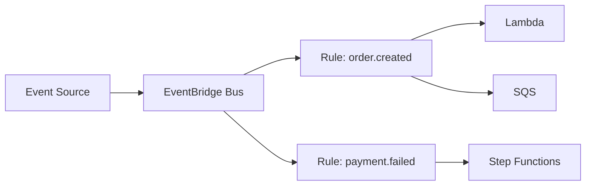

# Amazon EventBridge

## What It Is

Amazon EventBridge is a serverless event bus for routing events between AWS services, custom applications, and SaaS providers.

## Why It Exists

Modern architectures need loosely coupled event-driven integration with routing logic, filtering, and many sources.

## Core Concepts

- Event bus
- Rules with event patterns
- Targets such as Lambda, SQS, SNS, and Step Functions
- Custom buses and partner buses
- Scheduled rules and schemas

## How It Works

Event producers publish events to a bus. Rules match based on event content and route the event to targets. One event can trigger multiple rules and targets.

## When To Use

Use EventBridge for event-driven architectures, cross-service routing, SaaS event integration, and scheduled automation.

## When Not To Use

Do not use EventBridge for high-throughput ordered streaming; see [[Amazon Kinesis]]. For simple one-to-one background work, SQS may be simpler.

## Common Use Cases

- Reacting to AWS service events
- Building domain event buses
- Triggering workflows from application events
- Scheduling nightly jobs

## Security And Operations Considerations

Event patterns should be precise. Archive and replay can help debugging and recovery. Cross-account event bus policies need care.

## Common Mistakes

- Making event schemas too vague or unstable
- Treating EventBridge like a queue with consumer state
- Triggering loops where automation emits the same event it listens for

## Practical Example

An ecommerce platform emits `order.created`. EventBridge routes it to fraud checks, fulfillment workflow, and analytics independently.

## Related Notes

- [[Amazon SNS]]
- [[Amazon SQS]]
- [[AWS Step Functions]]
